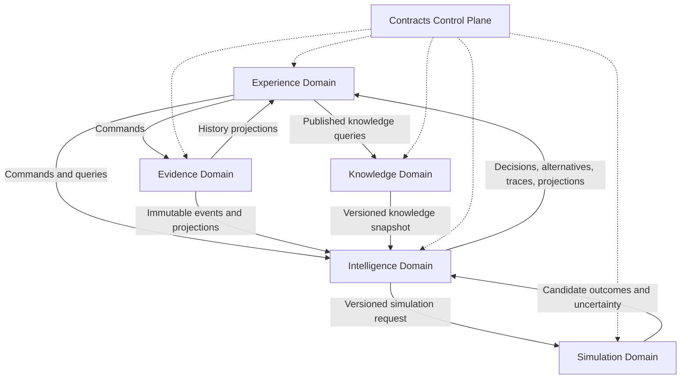

# Pool OS Architecture Constitution

**Document type:** Architecture Constitution  
**Constitution version:** 1.4.0  
**Status:** Active architectural baseline; ratification checklist remains open  
**Applies to:** Pool OS platform, applications, packages, services, tools, AI models, and data pipelines  
**Last updated:** 2026-07-20  
**Authority:** This document overrides feature-level RFCs, implementation notes, generated documentation, and framework conventions when they conflict with a constitutional rule.

---

## 1. Purpose

Pool OS is an AI coaching platform for billiards. Flutter is one delivery mechanism of that platform; it is not the architecture of the platform.

This constitution freezes the long-lived boundaries that allow Pool OS to evolve across mobile, web, desktop, cameras, smart glasses, simulation tools, and future coaching interfaces without repeatedly rebuilding its core. It defines:

- domain ownership;
- allowed dependencies and data flows;
- contracts between domains;
- versioning and provenance;
- the Evidence/Event model;
- Knowledge authoring and publication;
- Outcome and Measurement contracts;
- Mastery and Player Model boundaries;
- Simulation boundaries;
- Decision Trace and Decision Alternatives;
- compiler responsibilities;
- prohibited architectural behavior;
- enforcement and amendment rules.

This is not a product backlog, feature specification, implementation tutorial, or description of the current code. It defines the target rules that all future implementations must obey.

### 1.1 Constitutional objectives

The architecture SHALL ensure that:

1. Knowledge can change without requiring presentation code to understand its internals.
2. Intelligence can change without rewriting the Experience layer.
3. Evidence can be replayed by newer intelligence models without rewriting historical facts.
4. Simulation remains independent of users, coaching policy, and UI.
5. Every coaching decision can be reproduced or audited from versioned inputs.
6. Generated data is never mistaken for authoring data.
7. Domain contracts fail loudly when broken.
8. No AI-generated prose is treated as an explanation unless it is grounded in a structured Decision Trace.

### 1.2 Architectural style

Pool OS SHALL begin as a **modular monolith with explicit bounded domains**, public contracts, and ports/adapters. Domain boundaries are logical and enforceable even when modules are deployed in one process and stored in one SQLite database.

Microservices are not a goal. A domain MAY be extracted into a service only when operational evidence justifies independent deployment, scaling, security isolation, or technology choice. Extraction SHALL preserve the contracts defined here.

Pool OS uses selective CQRS and lightweight event sourcing. It SHALL NOT event-source every table or introduce distributed infrastructure merely to imitate a large-scale platform.

### 1.3 Target architecture is not implementation maturity

Architecture documents describe the intended destination. Maturity SHALL be
assessed from implemented boundaries, executable contracts, migration safety,
fitness tests, and automated enforcement, not from document completeness.

A complete architecture diagram does not prove that the code follows it. Every
architecture status report SHALL distinguish at least:

- vision/document maturity;
- contract maturity;
- implementation maturity;
- enforcement maturity;
- operational evidence.

### 1.4 Constitutional invariants and evolvable mechanisms

The following are constitutional invariants. They may change only through a
MAJOR constitution amendment with an explicit migration plan:

- the five domain boundaries;
- domain ownership and dependency direction;
- Evidence facts remain separate from Intelligence inferences;
- committed Evidence is corrected by new records rather than ordinary overwrite;
- Knowledge runtime artifacts are generated from canonical authoring;
- Experience does not infer Mastery or recommendations;
- Simulation does not know player identity, tactics, or Coach policy;
- decisions retain structured provenance and alternatives.

The following mechanisms are intentionally evolvable through versioned contracts:

- Knowledge, Outcome, and Measurement schemas;
- Player Model and Mastery models;
- compiler and publication implementation;
- Learning Planner and Coach policy;
- Simulation and Vision APIs;
- storage, projection, and deployment technology.

“Immutable” means constitutionally stable, not technically impossible to amend.
Evolvable mechanisms SHALL preserve compatibility within a major version and use
SemVer, adapters, upcasters, or coordinated migration for breaking changes.

### 1.5 Normative authority and architecture evidence

Pool OS distinguishes **what the system should do** from **what the system is
observed doing**.

Normative authority is defined by Section 20.1. Production behavior cannot amend
the Constitution or a contract by accident. A production bug, security failure,
or contract violation remains a defect even when it is repeatable.

When determining current implementation reality, evidence is weighted in this
order:

1. Observed production behavior, telemetry, and deployed configuration.
2. Executable contract conformance results.
3. Architecture, integration, migration, and fitness test results.
4. Deployed artifacts and source implementation.
5. Architecture and implementation documents.
6. Generated architecture projections, dashboards, and reports.

This is an **Architecture Evidence Hierarchy**, not a correctness hierarchy.
Higher evidence shows more reliably what currently happens; it does not prove
that behavior is intended or acceptable. When evidence conflicts with normative
authority, Pool OS SHALL record architecture drift or an incident, then change
the implementation or ratify a versioned amendment. Dashboards and projections
remain useful health views but never become sources of architectural truth.

---

## 2. System Model

Pool OS consists of five business domains and one architecture control plane.



The diagram describes runtime data flow, not unrestricted source-code imports. Compile-time dependencies are stricter and are defined in Section 5.

### 2.1 The five domains

| Domain | Core question | Owns |
|---|---|---|
| Knowledge | What is true or teachable about billiards? | Concepts, skills, techniques, rules, mistakes, drill definitions, outcomes, sources, learning dependencies |
| Evidence | What was observed or declared? | Immutable evidence events, artifact references, observation records, rebuildable projections |
| Intelligence | What can be inferred and what should happen next? | Player state estimates, mastery, planning, recommendations, decisions, alternatives, traces |
| Simulation | What physical outcomes are possible? | Ball state, collision, spin, trajectory, uncertainty, candidate physical outcomes |
| Experience | How do people and devices interact with Pool OS? | UI, navigation, input, command submission, projection rendering, localization presentation |

### 2.2 Contracts are not a sixth business domain

Contracts form an architecture control plane. They define stable messages and identifiers shared across boundaries, but they SHALL NOT contain business decisions, persistence implementations, Flutter widgets, or domain services.

Contracts SHALL be small, versioned, dependency-free where practical, and owned through an explicit review process. A domain contract may describe what crosses a boundary; it SHALL NOT expose the internal model of the producing domain.

---

## 3. Common Language

The following terms have constitutional meaning.

| Term | Meaning |
|---|---|
| Command | A request to perform an action. It may be rejected and is not historical fact. |
| Event | An immutable statement that something occurred. Events use past-tense names. |
| Evidence | A fact, measurement, declaration, or observation that may inform intelligence. Evidence is not a recommendation. |
| Artifact | Immutable or content-addressed media such as video, image, sensor capture, or exported table state. |
| Observation | Structured evidence derived from an artifact or direct measurement by a versioned producer. |
| Projection | A rebuildable read model derived from events or versioned snapshots. |
| Knowledge entry | A published, versioned unit that represents or teaches one or more knowledge nodes. |
| Outcome Contract | A declaration of an observable capability and the protocol by which it can be measured. |
| Measurement | Evidence produced by applying a measurement protocol. |
| Mastery Assessment | A versioned inference about capability, produced by Intelligence from Evidence and Knowledge. |
| Recommendation | A ranked candidate action, not yet necessarily selected. |
| Decision | The selected action produced by a versioned policy under explicit constraints. |
| Decision Trace | Structured causal record of inputs, transformations, constraints, scoring, and selection. |
| Decision Alternative | A candidate considered but not selected, including decomposed score and rejection reasons. |
| Knowledge Release | An immutable compiled snapshot of publishable Knowledge. |
| Source Snapshot | A versioned or content-addressed representation of an external source at a point in time. |

Names in code, events, schemas, and documentation SHALL use these meanings consistently.

---

## 4. Domain Ownership

### 4.1 Knowledge Domain

The Knowledge Domain owns the world of billiards knowledge independent of any player.

It owns:

- concepts;
- skills;
- techniques;
- rules;
- common mistakes and corrections;
- equipment definitions;
- terminology and localization content;
- drill definitions;
- Outcome Contracts;
- source citations and source snapshots;
- taxonomy and immutable ID registry;
- knowledge relations;
- hard and soft learning dependencies;
- authored learning-path templates;
- publication state and review metadata;
- Knowledge Release manifests.

The Knowledge Domain SHALL NOT know:

- who a player is;
- whether a specific player completed a drill;
- player performance, readiness, fatigue, ranking, or history;
- player mastery;
- recommendations or Coach decisions;
- UI state;
- match-specific strategy selected for a player;
- simulation results for a specific observed table unless stored only as authored examples.

Constitutional ownership examples:

| Model | Owner |
|---|---|
| `DrillDefinition` | Knowledge |
| `TechniqueDefinition` | Knowledge |
| `OutcomeContract` | Knowledge |
| `SourceSnapshot` | Knowledge |
| `LearningDependency` | Knowledge |

The authoring corpus is the Single Source of Truth for Knowledge. Runtime JSON, search indexes, graph indexes, caches, databases, and API responses are generated or derived artifacts.

### 4.2 Evidence Domain

The Evidence Domain owns facts created by people, devices, imports, matches, drills, and observation producers.

It owns:

- event envelopes and event streams;
- drill attempts and drill results;
- shots and shot outcomes;
- match and competition results as observed facts;
- readiness declarations;
- equipment-use observations;
- video and image artifact references;
- Vision observations;
- table-state observations;
- simulation requests/results only when preserved as evidence of an analysis session;
- correction, supersession, consent, retention, and redaction events;
- evidence projections used for history and analytics input.

The Evidence Domain SHALL NOT own:

- mastery scores;
- weakness classifications;
- recommendations;
- learning plans;
- Coach decisions;
- billiards definitions;
- authored source citations;
- physics algorithms;
- presentation formatting.

Constitutional ownership examples:

| Model | Owner |
|---|---|
| `DrillAttemptCompleted` | Evidence |
| `OutcomeMeasured` | Evidence |
| `ShotRecorded` | Evidence |
| `VideoCaptured` | Evidence |
| `VisionObservationProduced` | Evidence |

Evidence is not synonymous with a database. The Event Store is the canonical history for selected evidence streams. Operational tables and projections MAY coexist, but they SHALL be classified as source records, projections, caches, or external references.

### 4.3 Intelligence Domain

The Intelligence Domain owns inference and decision-making.

It consumes versioned Knowledge snapshots, Evidence snapshots/projections, and Simulation results. It owns:

- Player State estimates;
- inferred Player Model snapshots;
- mastery estimates;
- weakness and strength findings;
- readiness interpretation;
- learning-plan generation;
- prerequisite readiness assessment;
- recommendation generation and ranking;
- Coach policy;
- Decision Alternatives;
- Decision Traces;
- confidence and uncertainty attached to inferences;
- model evaluation and policy evaluation results.

The Intelligence Domain SHALL be internally modular. At minimum, it SHALL distinguish:

1. State Estimation.
2. Mastery Assessment.
3. Learning Planning.
4. Recommendation Ranking.
5. Coach Policy and Decision Selection.
6. Decision Explanation.

Coach is not a separate domain. Coach is an application service/policy
orchestrator inside Intelligence. Experience reaches it through an Intelligence
application port; Coach reaches Simulation through a Simulation port.

These modules MAY share a deployment unit. They SHALL NOT collapse into one unrestricted service or one mutable global player state.

The Intelligence Domain SHALL NOT:

- mutate Knowledge;
- rewrite or delete Evidence;
- publish Knowledge;
- implement UI;
- perform unversioned physics calculations;
- access Flutter providers as domain input;
- read domain tables directly when a contract/port is defined;
- allow its own prior recommendations to become evidence of player ability.

### 4.4 Simulation Domain

The Simulation Domain is the deterministic or probabilistic physics boundary.

It owns:

- table geometry;
- ball and cue-ball state;
- cue impact parameters;
- cloth and cushion parameters;
- spin, sliding, rolling, throw, squirt, swerve, collision, and reflection models;
- trajectory generation;
- scratch probability;
- physical outcome distributions;
- numerical uncertainty and calibration metadata;
- simulation engine and model versions.

It SHALL NOT know:

- player identity;
- player mastery;
- Coach policy;
- learning paths;
- run-out strategy;
- safety strategy;
- recommendation priority;
- UI state;
- whether a trajectory is emotionally or pedagogically suitable for a player.

Simulation may return 100 physically plausible trajectories. Intelligence may filter these by constraints, Knowledge may interpret them through tactics, and Coach policy may select one appropriate option. Pattern selection is not physics and SHALL NOT be embedded in the Simulation core.

Pattern definitions belong to Knowledge. Applying patterns to a concrete table,
filtering Simulation candidates, and ranking tactical plans belong to an internal
Pattern Planning module of Intelligence. Pattern Planning SHALL consume Simulation
results through the Simulation Contract and SHALL NOT be implemented inside the
physics engine or Experience layer.

### 4.5 Experience Domain

The Experience Domain owns interaction and presentation.

It includes:

- Flutter mobile and desktop applications;
- web applications;
- camera and smart-glasses interfaces;
- navigation and screen composition;
- forms and input validation for user experience;
- localization rendering;
- accessibility;
- command submission;
- query invocation;
- projection rendering;
- loading, empty, failure, and retry states;
- local presentation-only sorting and formatting.

Experience SHALL NOT infer mastery, weakness, learning priority, or recommendation. It SHALL NOT reconstruct Decision Traces from prose. It SHALL NOT read domain persistence directly. It SHALL render decisions and projections received through public application ports.

Experience MAY perform presentation logic such as formatting dates, grouping cards, choosing responsive layouts, and optimistic interaction feedback. Presentation logic SHALL NOT alter domain meaning.

---

## 5. Dependency Rules

### 5.1 Compile-time dependency rule

Dependencies SHALL point toward contracts and public domain APIs, never toward internal implementations.

| Caller | Contracts | Knowledge API | Evidence API | Intelligence API | Simulation API | Experience internals |
|---|:---:|:---:|:---:|:---:|:---:|:---:|
| Contracts | - | No | No | No | No | No |
| Knowledge | Yes | - | No | No | No | No |
| Evidence | Yes | No | - | No | No | No |
| Simulation | Yes | No | No | No | - | No |
| Intelligence | Yes | Via port | Via port | - | Via port | No |
| Experience | Yes | Via application port | Via application port | Via application port | No in production | - |
| Infrastructure/Wiring | Yes | Adapter only | Adapter only | Adapter only | Adapter only | Bootstrap only |

`Via port` means the consumer depends on an interface or versioned contract, not the producer's repository, database schema, internal model, or framework provider.

### 5.2 Runtime flow rules

1. Experience sends Commands and reads Projections.
2. Evidence accepts evidence-producing commands and appends Events.
3. Intelligence reads Knowledge snapshots and Evidence projections/snapshots.
4. Intelligence requests Simulation through a versioned Simulation Contract.
5. Simulation returns candidates and uncertainty; it does not select coaching actions.
6. Intelligence publishes decisions, alternatives, traces, mastery, and learning projections.
7. Experience renders those outputs without changing their meaning.

Domain independence is bounded by contract compatibility. A compatible Knowledge
content release SHOULD require no Intelligence code change. A breaking change to
taxonomy, Outcome semantics, dependency semantics, or a major contract version
requires an explicit adapter or coordinated migration; domain separation does not
eliminate compatibility work.

### 5.3 Prohibited dependency shortcuts

The following shortcuts are constitutionally forbidden:

- Coach reading SQLite tables directly.
- Flutter providers calculating mastery.
- Knowledge loading player history.
- Evidence invoking recommendation logic before appending an event.
- Simulation importing player or Coach models.
- Intelligence importing Flutter widgets, BuildContext, Riverpod providers, or navigation.
- One domain importing another domain's `internal`, `data`, or generated database files.
- Shared utility packages becoming an unowned dumping ground for domain logic.

### 5.4 Shared kernel limits

The shared kernel MAY contain only stable primitives such as:

- semantic IDs;
- timestamps and clock interfaces;
- locale identifiers;
- version identifiers;
- result/error envelopes;
- correlation and causation IDs;
- content hashes;
- units of measure.

It SHALL NOT contain Skill, Player, Match, Coach, Knowledge Entry, or Mastery behavior.

---

## 6. Contract Constitution

### 6.1 Contract principles

Every cross-domain contract SHALL be:

- explicit;
- versioned;
- serializable;
- independently testable;
- backward-compatible within a supported major version;
- free of framework-specific types;
- documented with ownership and semantics;
- validated at ingress and egress;
- represented by immutable values where practical.

Unknown required fields, unknown enum values, invalid IDs, and unsupported major versions SHALL fail loudly. Silent fallback to a default enum is forbidden at domain boundaries.

### 6.2 Contract versioning

Contract versions use semantic versioning:

- **MAJOR:** incompatible semantic or structural change;
- **MINOR:** backward-compatible optional capability;
- **PATCH:** clarification or validation correction without semantic change.

Persisted Events never change shape in place. A new interpretation requires an upcaster, a new event version, or a new derived observation.

### 6.3 Knowledge Contract

The Knowledge Contract exposes immutable release snapshots and query-safe entry projections. It SHALL expose:

- Knowledge Release ID and semantic version;
- release digest;
- taxonomy version;
- entry ID and revision;
- review/publication eligibility;
- relations and dependencies;
- Outcome Contracts;
- source snapshot references;
- compiler version;
- schema version.

It SHALL NOT expose authoring file paths as runtime identity.

### 6.4 Evidence Contract

Evidence events SHALL use an envelope equivalent to:

```yaml
eventId: evt_01...
eventType: DrillAttemptCompleted
eventVersion: 1
streamId: player_123
aggregateId: attempt_456
sequence: 1042
occurredAt: 2026-07-20T10:15:00Z
recordedAt: 2026-07-20T10:15:02Z
actorId: player_123
deviceId: device_abc
correlationId: corr_789
causationId: cmd_789
producer:
  name: pool_os_mobile
  version: 1.2.0
payload: {}
provenance:
  source: direct_entry
  confidence: 1.0
```

Event IDs SHALL be globally unique. A stream sequence SHALL be monotonic within its stream. Event time and recording time SHALL remain distinct.

### 6.5 Simulation Contract

A Simulation request SHALL include:

- contract version;
- engine/model requirement;
- table geometry and calibration version;
- ball state with units;
- cue-impact constraints;
- environmental parameters when known;
- requested outputs;
- deterministic seed when reproducibility is required.

A Simulation response SHALL include:

- engine and physics-model version;
- input digest;
- candidate trajectories;
- physical outcomes;
- uncertainty/confidence ranges;
- warnings for missing calibration;
- execution metadata;
- deterministic seed when used.

Simulation scores SHALL describe physical outcomes, not coaching suitability.

### 6.6 Intelligence and Coach Contract

An Intelligence request SHALL reference immutable input snapshots rather than ambient mutable state. An output SHALL identify:

- Intelligence model version;
- Mastery model version;
- Coach policy version;
- Knowledge Release and digest;
- Evidence cutoff/stream positions;
- Simulation version and input digest when used;
- constraints;
- selected decision;
- alternatives;
- structured Decision Trace;
- confidence and uncertainty;
- expiration or reassessment condition.

### 6.7 Experience Contract

Experience sends Commands with validation, actor, idempotency, correlation, and locale context. Experience reads query projections designed for presentation.

Experience SHALL NOT receive database rows as public contracts. It SHALL NOT depend on domain-specific persistence IDs when stable semantic IDs exist.

---

## 7. Versioning and Provenance

Pool OS SHALL distinguish all of the following versions.

| Version | Purpose |
|---|---|
| Knowledge schema version | Shape and semantics of Knowledge data |
| Knowledge Release version | Immutable published corpus snapshot, e.g. `1.5.2` |
| Knowledge Release digest | Content-addressed identity of exact compiled bytes |
| Entry revision | Revision of one stable Knowledge ID |
| Taxonomy version | Allowed kinds, topics, relations, and ID namespaces |
| Compiler version | Compiler implementation that produced the release |
| Source snapshot version/hash | Exact external evidence used by Knowledge |
| Evidence event version | Schema of one event type |
| Projection version | Algorithm/schema used to derive a read model |
| Mastery model version | Mastery inference semantics |
| Player Model version | Player-state inference semantics |
| Learning Planner version | Planning and path-cost semantics |
| Coach policy version | Decision selection and constraints |
| Simulation engine/model version | Physics and numerical behavior |
| Vision model version | Observation producer behavior |
| Experience application version | Delivery client release |

### 7.1 Knowledge Release manifest

Every Knowledge Release SHALL include a manifest equivalent to:

```yaml
knowledgeVersion: 1.5.2
knowledgeDigest: sha256:...
schemaVersion: 2.0.0
taxonomyVersion: 1.0.0
compilerVersion: 2.0.0
publishedAt: 2026-07-20T00:00:00Z
counts:
  entries: 890
  learningPaths: 32
  skills: 145
  relations: 2200
quality:
  reviewedPercent: 87.0
  verifiedPercent: 71.0
sourceSnapshotDigest: sha256:...
```

Counts and quality metrics describe a release. They do not replace its version or digest.

### 7.2 Recommendation provenance

Every persisted recommendation or decision SHALL retain enough provenance to answer:

1. Which Knowledge Release and exact entries were used?
2. Which Evidence cutoff and observations were used?
3. Which Mastery and Player Model versions were used?
4. Which Coach policy selected the decision?
5. Which Simulation/Vision versions contributed?
6. Which alternatives were considered?
7. When must the decision be reassessed?

### 7.3 Source provenance and staleness

A source record SHALL support:

- stable source ID;
- title and publisher;
- canonical URI;
- source type;
- publication date when known;
- declared source version when available;
- accessed date;
- last-modified date when observable;
- content hash or archived snapshot hash;
- license/usage restrictions;
- source snapshot URI;
- review owner.

An external source update does not mutate historical Knowledge Releases. It creates a new Source Snapshot and marks dependent authoring entries as candidates for review. A reviewed or verified article becomes `stale` only under an explicit freshness policy, not merely because time passed.

---

## 8. Knowledge Authoring and Publication

### 8.1 Single Source of Truth

The canonical Knowledge source SHALL be a version-controlled authoring corpus consisting of:

- Markdown articles;
- typed YAML front matter;
- machine-readable taxonomy registry;
- immutable ID registry;
- source registry and source snapshots;
- learning-path definitions;
- Outcome Contracts;
- media manifests.

Generated JSON is not authoring. Runtime databases are not authoring. Search indexes are not authoring. The legacy `Knowledge/` inventories and `app/assets/knowledge/` JSON files SHALL become migration inputs or archived artifacts, not competing sources of truth.

Target shape:

```text
packages/billiard_knowledge/
  authoring/
    articles/
      aim/
        ghost_ball.md
    outcomes/
    learning_paths/
    registry/
      taxonomy.yaml
      ids.yaml
      sources.yaml
      media.yaml
  compiler/
  assets/
    pack.json            # generated
    manifest.json        # generated
    search_index.json    # generated
    graph_index.json     # generated
  reports/               # generated, not authoritative
```

### 8.2 Markdown article contract

Markdown owns explanatory content. YAML front matter owns typed metadata and graph references.

```yaml
---
id: control.stop_shot
revision: 4
kind: technique
discipline: pool
topic: cue_ball_control
reviewState: published
origin: human
technicalReview: approved
localizationReview: approved
verificationStatus: verified
sourceIds:
  - source.drdave.stop_shot.2025_04
outcomeIds:
  - outcome.stop_shot.control_20cm
relations:
  - type: requires
    targetId: fundamental.stroke.delivery
  - type: preparesFor
    targetId: control.follow_shot
---
```

The compiler SHALL parse Markdown into typed, deterministic runtime structures. Front matter SHALL NOT contain unvalidated free-form enum values.

### 8.3 Review workflow

Review lifecycle and origin provenance are orthogonal.

Content lifecycle:

```text
Draft -> In Review -> Approved -> Published -> Deprecated
```

Origin provenance:

```text
Human | AI Generated | AI Assisted | Migrated
```

Review dimensions:

```text
Editorial Review
Technical Review
Localization Review
Source/Provenance Review
Safety Review where applicable
```

Verification status:

```text
Unverified | Verified | Stale | Disputed
```

`AI Generated` SHALL NOT be a lifecycle stage. AI-generated or AI-assisted content SHALL NOT self-approve, self-verify, or self-publish.

The production Coach SHALL consume only entries that are `Published`, technically approved, and `Verified` under the active publication policy. Draft, stale, disputed, or deprecated content SHALL be excluded from new coaching decisions unless an explicit controlled fallback policy records that use in the Decision Trace.

### 8.4 Publication pipeline


Publication SHALL be atomic. A failed gate produces no publishable release. A previous valid release remains available until a new release passes every required gate.

---

## 9. Knowledge Compiler Constitution

The Knowledge Compiler owns transformation and validation. It does not own editorial truth.

### 9.1 Required responsibilities

The compiler SHALL:

1. Parse Markdown and typed front matter.
2. Validate schema versions.
3. Validate taxonomy membership.
4. enforce immutable IDs and revisions;
5. detect duplicate IDs and aliases;
6. resolve source references;
7. resolve graph edges;
8. reject dangling references;
9. reject hard prerequisite cycles;
10. validate Outcome Contracts and measurement protocol references;
11. validate DrillDefinition references;
12. enforce review and publication gates;
13. validate bilingual requirements under publication policy;
14. build search, graph, dependency, and learning-path indexes;
15. produce deterministic JSON artifacts;
16. produce a Knowledge Release manifest and content digest;
17. produce quality, coverage, stale-source, and quarantine reports;
18. compare generated artifacts in CI to detect manual edits;
19. fail with actionable, stable error codes;
20. preserve provenance in compiled output.

### 9.2 Forbidden compiler behavior

The compiler SHALL NOT:

- invent missing content;
- silently map unknown taxonomy values to defaults;
- silently drop invalid relations;
- auto-verify AI-generated content;
- rewrite stable IDs;
- treat filenames as identity;
- update source citations without a new snapshot;
- publish partial output after a validation failure;
- use wall-clock time as an uncontrolled input to deterministic builds;
- mutate authoring files during normal compilation;
- make Coach decisions;
- calculate player mastery.

### 9.3 Corpus quarantine

Legacy content that cannot pass the active contract SHALL enter a quarantine report with reason codes. Quarantine is not publication. A quarantined item retains its original source location and proposed canonical ID but SHALL NOT be included in the production release.

Typical reason codes include:

- invalid encoding;
- missing bilingual title or summary;
- unknown taxonomy value;
- duplicate concept;
- unstable ID;
- missing source;
- unreviewed AI content;
- dangling relation;
- invalid Outcome Contract;
- hard dependency cycle.

---

## 10. Evidence and Event Store Constitution

### 10.1 Selective event sourcing

Pool OS SHALL event-source evidence where replay, audit, re-interpretation, or multi-model analysis has enduring value. It SHALL NOT event-source configuration, caches, generated indexes, UI state, or every CRUD entity by default.

Canonical evidence streams include:

- shot recording;
- drill attempts;
- match results;
- readiness declarations;
- artifact capture;
- Vision observations;
- table-state observations;
- measurement outcomes;
- evidence correction/supersession;
- consent and retention changes.

### 10.2 Immutability

Committed evidence events SHALL NOT be updated in place or overwritten. Corrections are represented by new events such as:

- `EvidenceCorrected`;
- `EvidenceSuperseded`;
- `ObservationInvalidated`;
- `ArtifactRedacted`;
- `ConsentWithdrawn`.

Projections SHALL honor correction and supersession semantics.

### 10.3 Privacy and legal erasure

Event immutability does not override privacy, consent, safety, or legal obligations. Personally identifiable data and raw media SHOULD be separated from durable event metadata through indirection, encryption, and artifact references.

When erasure is required, Pool OS MAY use:

- crypto-erasure of encryption keys;
- deletion of referenced artifacts under retention policy;
- irreversible tokenization;
- redaction tombstones;
- aggregate preservation without personal identity.

The system SHALL retain an auditable statement that erasure occurred without retaining prohibited content.

### 10.4 Artifacts and observations

A video is an Artifact, not a Vision conclusion. A Vision model produces an Observation that references the Artifact.

```text
VideoCaptured artifact A
  -> Vision model v1 -> Observation O1
  -> Vision model v5 -> Observation O2
```

O1 and O2 may disagree. Neither mutates A. Intelligence selects observations according to model policy, confidence, calibration, and evidence freshness. The selected observation IDs appear in the Decision Trace.

### 10.5 Projection rules

Projections SHALL be:

- rebuildable from known event positions and projection version;
- disposable without loss of canonical evidence;
- idempotent;
- deterministic for a fixed event stream and projection version;
- independently testable;
- tagged with last processed stream position.

A projection migration SHALL either rebuild from the Event Store or document why an in-place migration is equivalent.

---

## 11. Outcome Contract and Measurement

Outcome Contracts close the loop between Knowledge, Evidence, Intelligence, and Experience.

### 11.1 Ownership

| Item | Owner |
|---|---|
| Outcome definition | Knowledge |
| Measurement protocol definition | Knowledge |
| Drill definition | Knowledge |
| Attempt/result | Evidence |
| Measurement event | Evidence |
| Mastery inference | Intelligence |
| Unlock decision | Intelligence policy constrained by Knowledge |
| Progress rendering | Experience |

### 11.2 Outcome Contract shape

```yaml
id: outcome.stop_shot.control_20cm
revision: 2
skillId: control.stop_shot
statement:
  en: Keep the cue ball within 20 cm after object-ball contact.
  vi: Giữ bi cái trong bán kính 20 cm sau va chạm với bi mục tiêu.
measurementProtocol:
  id: protocol.drill.B002.stop_20cm
  version: 2
  drillDefinitionId: drill.B002
  metric: successful_attempts
  unit: count
  sampleSize: 25
  successCondition:
    operator: greater_than_or_equal
    value: 20
masteryPolicyHint:
  confirmationsRequired: 2
  retentionWindowDays: 14
  minimumEvidenceQuality: 0.8
unlocks:
  - control.follow_shot
```

### 11.3 Measurement rules

A measurement SHALL reference:

- Outcome Contract ID and revision;
- measurement protocol ID and version;
- DrillDefinition ID and revision when applicable;
- Attempt/Event IDs;
- metric, unit, sample size, and conditions;
- environment and equipment context when relevant;
- observation producer/model version;
- confidence/evidence quality;
- measured time.

Changing the protocol creates a new protocol version. Historical measurements remain interpretable under their original protocol.

### 11.4 Unlock rules

An Outcome Contract may declare what it prepares for or may unlock. Intelligence decides whether a specific player unlocks the next item, using versioned policy and sufficient Evidence. One successful attempt SHALL NOT automatically imply permanent mastery unless the active Mastery policy explicitly permits it.

---

## 12. Knowledge Graph and Skill Dependency Graph

Knowledge is a graph; articles are one class of graph resource, not the entire graph.

### 12.1 Node types

The graph MAY contain:

- Concept;
- Skill;
- Technique;
- Rule;
- Mistake;
- Correction;
- Equipment;
- DrillDefinition;
- OutcomeContract;
- MeasurementProtocol;
- SourceSnapshot;
- KnowledgeArticle;
- LearningPath;
- Discipline.

### 12.2 Relation types

Relations SHALL have explicit semantics. At minimum:

| Relation | Meaning | Graph constraint |
|---|---|---|
| `requires` | Hard prerequisite | Must be acyclic |
| `recommendedBefore` | Soft prerequisite | Cycles discouraged but allowed with justification |
| `preparesFor` | Builds toward another node | Directed |
| `supports` | Improves or supports capability | Directed |
| `corrects` | Corrects a mistake | Directed |
| `measuredBy` | Links outcome to protocol | Directed |
| `practicedBy` | Links knowledge to drill | Directed |
| `governedBy` | Links action/game to rule | Directed |
| `uses` | Uses equipment/concept | Directed |
| `related` | Non-causal association | Symmetric projection allowed |
| `opposes` | Contrasting concept | Symmetric |
| `deprecatedBy` | Replacement path | Directed, target active |

The Skill Dependency Graph SHALL be a validated projection of typed Knowledge relations, not an independently edited second source of truth.

### 12.3 Learning-path computation

Coach SHALL NOT select a path using unweighted shortest path alone. A Learning Planner may optimize over:

- hard prerequisites;
- current mastery probability;
- evidence confidence;
- estimated practice time;
- retention risk;
- player goals;
- available equipment/time;
- expected outcome impact;
- safety constraints;
- learning cost;
- policy priorities.

The path and cost model SHALL be versioned and included in the Decision Trace.

---

## 13. Player Model and Mastery

### 13.1 Player facts versus inferences

Pool OS SHALL distinguish:

| Category | Examples | Canonical owner |
|---|---|---|
| Declared facts | dominant hand, goals, preferences | Evidence/Profile source record |
| Observed facts | attempts, shots, results, readiness | Evidence |
| Derived state | fatigue estimate, form trend | Intelligence |
| Mastery | probability of satisfying outcomes | Intelligence |
| Recommendation | proposed next action | Intelligence |
| Decision | selected action under policy | Intelligence |

An inferred Player Model SHALL be a versioned projection with input evidence cutoff, model version, confidence, and generated time. It SHALL NOT overwrite declared or observed facts.

### 13.2 Mastery constitution

Mastery SHALL be outcome-centered rather than article-completion-centered. Reading an article is Evidence of exposure, not proof of mastery.

A Mastery Assessment SHALL include:

- player ID;
- skill/outcome ID and revision;
- mastery model version;
- evidence cutoff and evidence IDs or digest;
- estimated mastery probability or calibrated level;
- confidence/uncertainty;
- retention estimate when supported;
- supporting and contradicting evidence;
- generated time;
- expiration/reassessment condition.

Failure rate and Coach confidence are not static Knowledge difficulty fields. Cohort failure rate belongs to analytics projections. Coach confidence belongs to an Intelligence output. Baseline complexity and estimated practice range may belong to Knowledge when their derivation is documented.

---

## 14. Decision Trace and Alternatives

Explainability is a structured decision record, not generated prose.

### 14.1 Required Decision Trace

A Decision Trace SHALL preserve the causal chain:

```text
Evidence snapshot
  -> findings/weaknesses
  -> Player Model and Mastery snapshot
  -> prerequisites and constraints
  -> candidate generation
  -> score decomposition
  -> policy filters
  -> alternatives
  -> selected decision
  -> reassessment condition
```

### 14.2 Decision record example

```yaml
decisionId: decision_01...
decisionType: next_training_action
selectedCandidateId: control.stop_shot
knowledge:
  release: 1.5.2
  digest: sha256:...
evidence:
  cutoff: 1042
  snapshotDigest: sha256:...
models:
  playerModel: 2.1.0
  mastery: 3.0.0
  learningPlanner: 1.2.0
  coachPolicy: 4.0.0
findings:
  - position_quality_low
  - stop_shot_mastery_below_threshold
alternatives:
  - candidateId: control.stop_shot
    totalScore: 0.91
    components:
      weaknessImpact: 0.91
      prerequisiteReadiness: 1.00
      evidenceConfidence: 0.87
      learningCostFit: 0.81
      policyFit: 0.92
    selected: true
  - candidateId: control.draw_shot
    totalScore: 0.65
    selected: false
    rejectedBecause:
      - stop_shot_prerequisite_not_mastered
reassessAfter:
  eventType: DrillAttemptCompleted
  attempts: 75
```

### 14.3 Decision Alternatives

The selected candidate alone is insufficient. Intelligence SHALL retain the top alternatives needed to explain material rejections. A total score without components is not explainable.

The system MAY avoid storing every generated candidate when volume is excessive, but SHALL retain:

- the selected candidate;
- meaningful runner-up candidates;
- all candidates rejected by hard constraints when relevant to explanation;
- decomposed scores;
- rejection reason codes;
- policy and model versions.

### 14.4 Natural-language explanation

An LLM or template engine MAY render a natural-language explanation from a Decision Trace. It SHALL NOT invent causes, alternatives, measurements, or confidence absent from the trace. The trace remains authoritative when prose conflicts with structured data.

---

## 15. Simulation Constitution

### 15.1 Purity and determinism

For identical normalized inputs, engine/model version, calibration, and deterministic seed, Simulation SHOULD return reproducible results within declared numerical tolerance.

Simulation SHALL declare units and coordinate systems. Hidden unit conversion is forbidden at contract boundaries.

### 15.2 Uncertainty

Simulation SHALL not present uncalibrated physical predictions as certainty. Outputs SHOULD quantify uncertainty from:

- table calibration;
- ball positions;
- cue speed;
- tip contact point;
- cloth friction;
- cushion response;
- spin estimation;
- camera/vision error;
- numerical approximation.

### 15.3 Separation from strategy

Simulation answers “what could physically happen?” Intelligence answers “which candidate is appropriate?” Knowledge answers “what does this mean and how is it taught?” Experience answers “how is it presented and controlled?”

No Simulation module may rank a trajectory using player mastery or Coach policy.

---

## 16. Experience Constitution

### 16.1 Command/query separation

Experience MAY:

- send commands;
- validate input syntax and required fields;
- show pending command state;
- retry idempotent commands;
- query Knowledge, Evidence history, and Intelligence projections through public ports;
- render Decision Trace and Alternatives;
- request a new decision through an Intelligence application port.

Experience SHALL NOT:

- update event rows directly;
- calculate mastery locally;
- choose a learning path independently;
- infer weaknesses from charts;
- bypass publication eligibility;
- call Simulation directly in production coaching flows;
- reconstruct domain decisions from UI state;
- persist a recommendation as if it were evidence of ability.

### 16.2 Multiple experiences

Mobile, web, desktop, smart glasses, camera clients, and future devices SHALL consume the same domain contracts. Device-specific behavior belongs in Experience adapters unless it produces Evidence, in which case it crosses through an Evidence command contract.

---

## 17. Explicit Prohibitions

The following actions are forbidden unless this constitution is amended or a time-bounded exception is approved under Section 20.

1. Maintaining multiple editable sources of Knowledge truth.
2. Editing generated Knowledge JSON by hand.
3. Using runtime asset paths as stable Knowledge IDs.
4. Renaming a published semantic ID.
5. Reusing a deprecated ID for a different meaning.
6. Adding taxonomy values without a taxonomy version change and review.
7. Silently defaulting unknown contract enums.
8. Publishing AI-generated content without required human and technical review.
9. Storing player telemetry in Knowledge.
10. Storing mastery or recommendation in Evidence as a fact.
11. Allowing Knowledge to calculate Mastery.
12. Allowing Experience to infer or rank recommendations.
13. Allowing Coach/Intelligence to query database tables directly across domain ownership.
14. Allowing Intelligence to rewrite historical Evidence.
15. Allowing prior Coach recommendations to become evidence of player skill.
16. Allowing Simulation to know player identity, Coach policy, or learning priority.
17. Treating a raw video as a Vision conclusion.
18. Overwriting an old Vision observation when a new model runs.
19. Persisting a Decision without input/model/policy provenance.
20. Persisting only a total candidate score without reason components.
21. Generating explanation prose not grounded in a Decision Trace.
22. Treating article completion as mastery.
23. Changing a measurement protocol without versioning it.
24. Using a single successful drill attempt as permanent mastery without explicit policy.
25. Hard-coding learning dependencies separately from the canonical Knowledge graph.
26. Allowing hard prerequisite cycles.
27. Treating projections or caches as canonical Evidence.
28. Applying destructive event edits for ordinary corrections.
29. Using event immutability to ignore privacy or legal erasure obligations.
30. Introducing microservices before domain boundaries and contracts are enforced in the modular monolith.

---

## 18. Enforcement

### 18.1 Automated architecture gates

CI SHALL progressively enforce:

- domain import boundaries;
- contract compatibility;
- Knowledge compiler determinism;
- generated artifact drift;
- taxonomy and ID freeze;
- source and review gates;
- graph reference integrity;
- hard dependency acyclicity;
- Outcome Contract validity;
- event schema compatibility;
- projection replay tests;
- Decision Trace completeness;
- migration tests;
- privacy and artifact-retention rules where automatable.

### 18.2 Required test classes

| Area | Required tests |
|---|---|
| Knowledge | compile, validate, deterministic rebuild, graph integrity, publication eligibility |
| Evidence | append-only behavior, idempotency, ordering, correction/supersession, replay |
| Intelligence | snapshot reproducibility, model-version isolation, alternative ranking, trace completeness |
| Simulation | deterministic fixtures, numerical tolerance, units, uncertainty, calibration |
| Experience | contract rendering, command behavior, no local inference |
| Contracts | backward compatibility, serialization, unsupported-version rejection |

### 18.3 Architectural fitness functions

The repository SHOULD include executable fitness functions that fail when:

- Experience imports an Intelligence implementation instead of its port;
- a domain imports another domain's persistence layer;
- an Event type is renamed or mutated without a version;
- generated Knowledge output differs from compiler output;
- published Knowledge lacks provenance;
- a Decision lacks alternatives or provenance;
- a hard dependency cycle appears.

### 18.4 Architecture observability

Architecture health is broader than pass/fail tests. CI SHOULD generate a
versioned or retained health report containing:

- domain dependency graph;
- package/import graph;
- circular dependencies;
- layer and persistence-boundary violations;
- known versus new architecture debt;
- contract compatibility drift;
- Knowledge/generated artifact drift;
- compiler determinism drift;
- package boundary drift;
- trend counts compared with the previous baseline.

Health reports are projections, not architectural truth. They SHALL link every
violation to a stable rule ID and source/target path so debt can be ratcheted
down. A green test run with worsening baselined debt is not sufficient evidence
of architecture health.

### 18.5 Definition of Done

A feature is not done merely because its UI works. A cross-domain feature is done only when:

- ownership is explicit;
- contracts are versioned;
- commands and events are distinguished;
- provenance is preserved;
- errors fail visibly;
- replay/migration behavior is tested where relevant;
- no forbidden dependency is introduced;
- architecture documentation and contract examples are updated.

---

## 19. Migration Strategy

Pool OS SHALL migrate incrementally using a strangler approach inside the modular monolith.

### Stabilization gate

Until the contract foundation and first deterministic Knowledge Release are in
place, Pool OS SHALL pause work that expands architectural surface area. The gate
blocks new cross-domain features, bulk Knowledge expansion, AI Vision product
features, Table Analysis, and new Simulation product features.

The gate does not block:

- bug and UAT fixes;
- security, privacy, and data-integrity fixes;
- migration and backup safety;
- accessibility and production stability work;
- domain-boundary extraction;
- contract, schema, fixture, compiler, publication, and architecture-test work;
- explicitly approved constitutional exceptions.

The gate is removed only after Phase E exit criteria pass. This is a controlled
stabilization period, not a permanent ban on product development.

### Phase A — Ratify boundaries

- Approve this constitution.
- Create domain package/module boundaries.
- Introduce contract packages with no behavior.
- Add import-boundary checks.

### Phase B — Contract foundation

- Freeze taxonomy and semantic IDs.
- Define the Knowledge Entry schema.
- Define Source, review, publication, and provenance schemas.
- Define DrillDefinition references and identity rules.
- Define Outcome Contracts.
- Define Measurement Protocols.
- Add valid and invalid compatibility fixtures for every contract.
- Ratify the compiler input/output specification against those contracts.

Phase B exits only when Outcome and Measurement semantics can be validated
without depending on compiler implementation.

### Phase C — Architecture tests and observability

- Enforce domain import boundaries with executable fitness tests.
- Commit a reviewed baseline for legacy architecture debt.
- Fail CI on new violations and stale baseline entries.
- Generate dependency, import, layer-violation, and drift health reports.
- Add contract compatibility tests and invalid fixtures.

Phase C exits when a new cross-domain violation cannot enter the main branch
without an explicit, reviewed constitutional exception.

### Phase D — Canonical Knowledge and compiler

- Establish Markdown authoring and typed registries.
- Implement compiler and publication gates.
- Prove deterministic builds and generated-artifact drift detection.

Phase D exits only when a clean checkout can deterministically rebuild the same
Knowledge Release digest and all publication gates pass.

### Phase E — Corpus migration

- Split the existing 36 reviewed entries into canonical authoring.
- Quarantine and map the larger legacy corpus.
- Retire direct runtime ownership of `app/assets/knowledge`.

Phase E exits when production reads one generated Knowledge Release, legacy
sources are read-only migration inputs, and every migrated item is published or
quarantined with a reason code.

### Phase F — Evidence foundation

- Define Evidence event envelope and stream policy.
- Add append-only event storage for selected evidence streams.
- Build rebuildable projections alongside current tables.
- Separate Artifacts from Observations.

### Phase G — Intelligence reconstruction

- Rebuild Player Model as a versioned inference projection.
- Rebuild Mastery around Outcomes and Evidence.
- Implement Learning Planner against the dependency graph.
- Add Decision Alternatives and structured traces.
- Prevent decision feedback from contaminating evidence.

### Phase H — Simulation and Vision

- Freeze units, coordinates, and table-state contracts.
- Build deterministic physics fixtures.
- Add Simulation adapter to Intelligence.
- Add artifact/observation pipelines for Vision.
- Reprocess immutable artifacts with new model versions.

### Phase I — Corpus expansion

- Expand only through the publication pipeline.
- Grow from reviewed core coverage to 300–500 entries.
- Measure graph, source, outcome, and review coverage.
- Scale beyond 1,000 entries only after compiler and graph operations remain deterministic and maintainable.

No phase requires a big-bang rewrite. Legacy modules may remain behind adapters while replacement contracts and projections are verified.

---

## 20. Governance and Amendments

### 20.1 Authority order

When documents conflict, authority is:

1. This Architecture Constitution.
2. Ratified Architecture Decision Records.
3. Versioned domain contracts.
4. Product RFCs and feature specifications.
5. Implementation documentation.
6. Generated reports and comments.

### 20.2 ADR authority and evidence linkage

Every Architecture Decision Record SHALL identify both:

1. **Normative Authority:** the Constitution section, ratified parent ADR, and
   versioned contract that permit or constrain the decision.
2. **Architecture Evidence:** the executable checks and operational signals that
   demonstrate the implementation currently conforms.

An ADR SHALL include an Evidence Plan at decision time. Evidence MAY include
contract tests, architecture fitness rules, integration/migration tests,
production metrics, and architecture health reports. Missing production evidence
must be recorded as `not_available` with an owner or planned signal; absence of a
metric is never evidence of compliance.

ADR evidence is expected to evolve. Test paths, metric names, last verification
time, and conformance status MAY be updated or appended without changing the
historical decision. Evidence does not grant authority: repeated production
behavior that violates the cited authority is drift or an incident, not an
implicit ADR amendment.

### 20.3 Amendment process

A constitutional amendment requires:

- problem statement;
- affected rules and domains;
- alternatives considered;
- compatibility and migration impact;
- data/provenance impact;
- security/privacy impact;
- test and enforcement changes;
- explicit approval;
- a constitution version increment.

Editorial clarifications increment PATCH. Backward-compatible rule additions increment MINOR. Boundary, ownership, or dependency changes increment MAJOR.

### 20.4 Exceptions

An exception SHALL be:

- explicit;
- narrowly scoped;
- owned by a named role/person;
- time-bounded;
- recorded with rationale;
- accompanied by a removal plan;
- prevented from becoming a silent precedent.

“Temporary” code without an expiry condition is not an approved exception.

### 20.5 AI contributor rule

Claude, Codex, Cursor, and all other AI or human contributors SHALL read and obey this constitution before making architectural or cross-domain changes.

An AI contributor SHALL:

- identify affected domains;
- state contract changes;
- preserve version/provenance;
- avoid forbidden dependencies;
- run architecture gates;
- report any constitutional conflict instead of silently working around it.

---

## 21. Ratification Checklist

This constitution is ready to move from `Active architectural baseline` to `Ratified` when the project owner confirms:

- [ ] The five domain names and ownership boundaries are accepted.
- [ ] Contracts are accepted as a control plane, not a business domain.
- [ ] Compile-time dependency rules are accepted.
- [ ] Knowledge authoring uses Markdown plus typed registries.
- [ ] Generated JSON is not a source of truth.
- [ ] Knowledge Release versioning and digest requirements are accepted.
- [ ] Review workflow and publication eligibility are accepted.
- [ ] Selective event sourcing is accepted.
- [ ] Privacy/legal erasure constraints are accepted.
- [ ] Outcome/Measurement ownership is accepted.
- [ ] Mastery is outcome-centered and owned by Intelligence.
- [ ] Decision Alternatives and structured Decision Trace are mandatory.
- [ ] Simulation is independent of strategy, player, Coach, and UI.
- [ ] The explicit prohibitions are accepted.
- [ ] Amendment and exception processes are accepted.
- [ ] ADRs must link normative authority and architecture evidence.

After ratification, the first implementation work SHALL be executable contract
alignment, architecture enforcement, and then compiler alignment, not bulk
Knowledge expansion.

---

## Appendix A — Canonical Ownership Summary

| Concept | Owner | Not owned by |
|---|---|---|
| Technique | Knowledge | Intelligence, Experience |
| DrillDefinition | Knowledge | Evidence |
| DrillAttempt | Evidence | Knowledge |
| OutcomeContract | Knowledge | Intelligence |
| OutcomeMeasurement | Evidence | Knowledge |
| Player declared goal | Evidence/Profile record | Intelligence inference |
| MasteryAssessment | Intelligence | Knowledge, Evidence |
| Recommendation | Intelligence | Experience |
| DecisionTrace | Intelligence | LLM renderer |
| Video Artifact | Evidence/Artifact storage | Vision model |
| Vision Observation | Evidence | Simulation |
| Trajectory candidate | Simulation | Coach policy |
| Pattern strategy | Knowledge/Intelligence | Simulation core |
| Dashboard card | Experience | Intelligence |

## Appendix B — Minimum Decision Explainability

A user-facing explanation is valid only when the underlying Decision Trace can answer:

1. What was observed?
2. Which observations were trusted and why?
3. What weakness or opportunity was inferred?
4. What is the current mastery estimate and confidence?
5. Which prerequisites and constraints applied?
6. Which candidates were considered?
7. How was each material candidate scored?
8. Why was the selected candidate chosen?
9. Why were obvious alternatives rejected?
10. Which Knowledge, model, policy, and Simulation versions were used?
11. What new Evidence will trigger reassessment?

If these questions cannot be answered from structured records, Pool OS does not yet have explainability for that decision.

## Appendix C — Architectural North Star

Pool OS succeeds when a future interface can be replaced without changing coaching intelligence; a future intelligence model can be replaced without rewriting historical evidence; a future Vision model can reprocess old artifacts; a future physics engine can improve trajectories without learning player identity; and every decision remains attributable to exact Knowledge, Evidence, model, policy, and Simulation versions.

That is the platform boundary this constitution protects.
