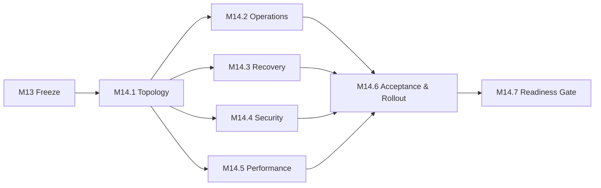

# M14.0 Production Readiness & Release Planning

**Status:** Accepted; Closed
**Date:** 2026-07-22

## Objective

Define an implementation-neutral, executable sequence for taking the frozen
M3-M13 system through production readiness and controlled release. M14.0 adds
planning only and does not authorize infrastructure or runtime behavior.

## Capability Inventory

| Capability | Outcome | Depends on |
|---|---|---|
| M14.1 Release Architecture & Topology | Approved environments, units, trust boundaries, and ownership | M13 Freeze |
| M14.2 Operational Readiness | SLOs, telemetry requirements, alert policy, runbooks | M14.1 |
| M14.3 Data Protection & Recovery | Backup, restore, DR targets, recovery evidence | M14.1 |
| M14.4 Security Readiness | Threat controls, secrets, privacy, supply-chain gates | M14.1 |
| M14.5 Performance Readiness | Workloads, budgets, capacity and degradation gates | M14.1 |
| M14.6 Acceptance & Rollout | Acceptance matrix, staged deployment and rollback decisions | M14.2-M14.5 |
| M14.7 Production Readiness Gate | Evidence aggregation and release decision | M14.6 |

## Implementation Sequence

1. Ratify topology, environments, ownership, data classification, and release
   authority before selecting implementation products.
2. Define measurable operational, recovery, security, and performance gates in
   parallel against the ratified topology.
3. Build the acceptance matrix and rollout/rollback sequence only after all
   four gate families have named owners and evidence locations.
4. Run an independent production-readiness review. Release requires every
   mandatory gate to pass; missing evidence is a failure, not a waiver.
5. Authorize implementation in later milestones as separately scoped work.

## Definition of Done

- Capability graph is complete, ordered, acyclic, and owner-ready.
- Consolidated release plan covers every Product Owner topic.
- ADR-013 is Proposed and cites Constitution authority plus M13 evidence.
- Every gate identifies owner, required evidence, pass condition, and rollback.
- No production, adapter, Flutter, infrastructure, test, benchmark, freeze, or
  generated artifact changes exist.
- Worktree contains only the four authorized M14.0 files.
- Existing app, Knowledge, protected freeze, Architecture Fitness, and diff
  checks pass unchanged.

## Acceptance Criteria

M14.0 acceptance authorizes planning outcomes only. It does not authorize a
provider, cloud, deployment mechanism, monitoring stack, security control,
benchmark harness, migration, or release.

## Evidence Requirements

Engineering must report document inventory, dependency-cycle check, protected
artifact status, full regression, Architecture Fitness, and `git diff --check`.

## Engineering Evidence

- Authorized document inventory: 4/4 files only.
- Capability dependency graph: 7 M14 capabilities, 10 edges, 0 cycles.
- Full app regression: 881/881 tests passed.
- Knowledge package regression: 75/75 tests passed.
- Protected M3-M13 freeze regression: 44/44 tests passed.
- Architecture Fitness: 133 existing violations, 0 new violations.
- `git diff --check`: clean.
- Protected freeze, generated, production, and publication artifacts: unchanged.

## Product Owner Decision

Accepted and closed on 2026-07-22. M14.1 Production Deployment Topology
Planning is authorized next as planning-only work.
