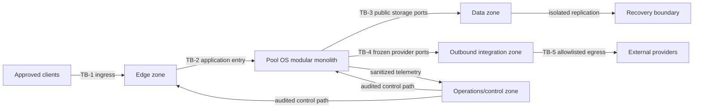
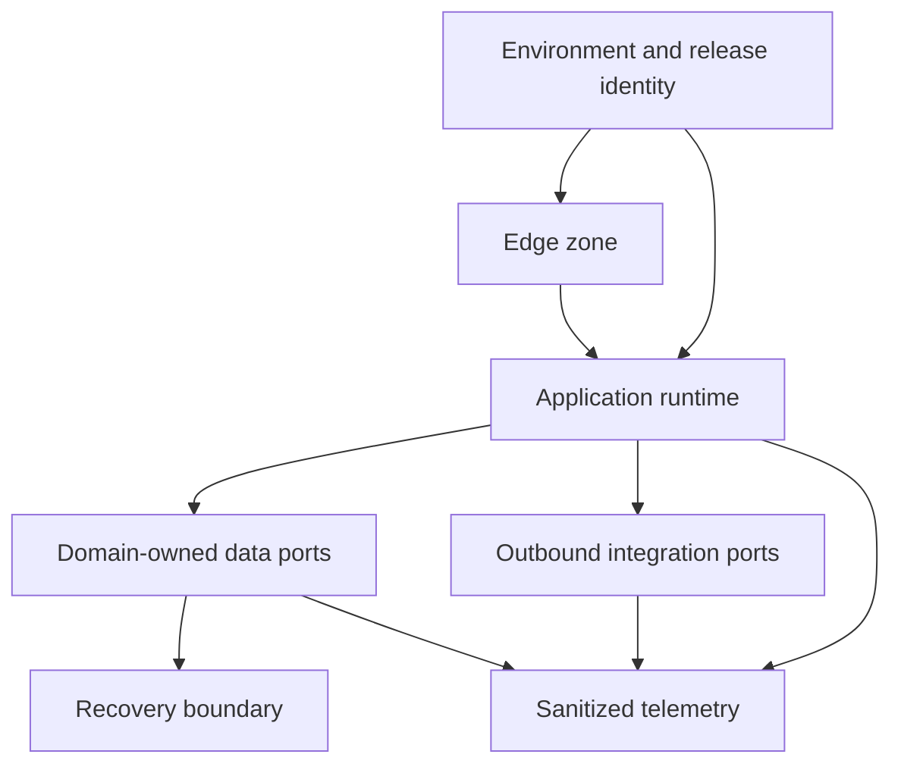

# M14.1 Production Deployment Topology Planning

**Status:** Accepted; Closed
**Date:** 2026-07-22

## Objective

Define the implementation-neutral deployment topology that later M14
readiness plans must use. This milestone selects no provider, product, region,
protocol, or deployment mechanism and introduces no runtime behavior.

## Authority And Ownership

- Architecture owns the logical topology and trust-boundary model.
- Platform owns later infrastructure realization and environment isolation.
- Application owns the modular-monolith deployment contract.
- Domain owners retain ownership of Knowledge, Evidence, Intelligence, Player,
  Experience, Simulation, and their public ports/contracts.
- Operations and Security own later operational and control evidence.

No cross-domain contract is changed. Frozen M3-M13 contracts remain the only
authorized runtime boundaries, and ADR-013 remains Proposed.

## Topology Principles

1. Pool OS remains a modular monolith until operational evidence justifies an
   extraction through the constitutional amendment process.
2. Local, integration, release-candidate, and production environments are
   isolated identities; artifacts are promoted, never rebuilt between stages.
3. Stateful resources, secrets, telemetry, and external providers sit behind
   explicit public ports and trust boundaries.
4. Inbound and outbound access is deny-by-default and allowlisted by declared
   purpose, owner, data class, and environment.
5. Missing identity, provenance, compatibility, route, or ownership evidence
   fails closed.

## Environment Separation

| Environment | Purpose | Data rule | External access | Promotion rule |
|---|---|---|---|---|
| Local | Contributor development | Synthetic/local only | Disabled or explicit sandbox | Never promotes state |
| Integration | Contract and integration verification | Synthetic or approved test fixtures | Sandbox endpoints only | Receives immutable candidate artifact |
| Release candidate | Production-like acceptance | Sanitized, controlled datasets | Production-like isolated dependencies | Same artifact is promoted unchanged |
| Production | User-serving runtime | Production data under domain policy | Explicitly approved production endpoints | Requires M14.7 readiness decision |

Credentials, encryption material, network identities, storage, telemetry, and
provider accounts must not be shared across environments. Production data may
not be copied downward unless a separately approved sanitization process proves
policy compliance.

## Logical Runtime Zones

| Zone | Responsibility | Allowed dependencies | Prohibited ownership |
|---|---|---|---|
| Edge | Terminate approved ingress and enforce coarse traffic policy | Application entry port | Domain decisions and data mutation |
| Application runtime | Host the Pool OS modular monolith and frozen public contracts | Public persistence, transport, AI, and telemetry ports | Infrastructure credentials and provider-specific policy |
| Data | Durable Evidence, event history, projections, Knowledge/publication artifacts, and recovery copies by domain policy | Domain-owned storage ports | Coach, recommendation, or inference policy |
| Outbound integration | Mediate approved AI/provider and external service egress | Frozen adapter/provider contracts | Direct access to domain internals |
| Operations/control | Observe release/runtime health and administer approved changes | Sanitized telemetry and audited control paths | User traffic and business decisions |

## Trust Boundaries

| Boundary | Crossing | Required planning evidence | Owner |
|---|---|---|---|
| TB-1 | Client to edge | Authn/authz class, abuse controls, request limits, data classification | Security |
| TB-2 | Edge to application | Release identity, route inventory, correlation identity, failure behavior | Platform |
| TB-3 | Application to data | Domain owner, port contract, encryption class, retention, RPO/RTO | Data/domain owners |
| TB-4 | Application to outbound integration | Capability/provider compatibility, payload class, timeout/failure policy | Intelligence/integration owners |
| TB-5 | Integration to external provider | Destination allowlist, credential owner, residency/privacy review, kill switch | Security |
| TB-6 | Runtime to operations/control | Telemetry schema, redaction, access control, audit retention | Operations |
| TB-7 | Primary data to recovery boundary | Replication identity, integrity proof, restore isolation | Data/platform owners |

No boundary authorizes bypassing a frozen contract. Control-plane access cannot
rewrite Evidence, published Knowledge history, or deterministic provenance.

## Ingress And Egress Plan

Ingress exposes only an application-owned entry surface through the edge zone.
Administrative and operational access uses a separate audited control path.
Direct public access to application instances, data stores, recovery copies,
telemetry stores, or provider credentials is prohibited.

Egress is declared per destination and capability. The application runtime may
reach external systems only through frozen public adapter/provider ports and
the outbound integration zone. Unknown destinations, cross-environment routes,
and direct domain-internal egress fail closed. Concrete protocols, endpoints,
certificate mechanisms, and firewall rules remain later implementation work.

## Runtime Placement And Availability Assumptions

- The application remains one logical modular-monolith deployment unit.
- Production must tolerate loss of one application instance without violating
  deterministic contracts; exact replica count is capacity evidence, not a
  fixed architectural constant.
- Mutable durable state is not tied to an application instance.
- Release-candidate topology must be logically equivalent to production for
  every boundary exercised by acceptance evidence.
- Health gating must distinguish instance, dependency, zone, and release
  failures; concrete probes and alert mechanisms belong to M14.2.
- Data recovery topology and numeric RPO/RTO belong to M14.3.
- Region count, site-failure tolerance, and provider redundancy remain open
  until business continuity targets and measured capacity justify them.

These are planning assumptions, not claims that availability mechanisms exist.

## Dependency Relationships

The graph has seven nodes, nine directed edges, and zero cycles. Operations
observes but is not a runtime dependency for deterministic business behavior.

## Infrastructure Ownership Matrix

| Concern | Accountable | Consulted | Required handoff |
|---|---|---|---|
| Environment and release identity | Platform | Application, Security | Immutable identity and promotion record |
| Edge and segmentation | Platform | Security, Application | Boundary inventory and approved routes |
| Application placement | Application | Platform, Operations | Deployment-unit and health contract |
| Domain data placement | Relevant domain owner | Platform, Security | Classification, retention, recovery requirements |
| External provider boundary | Intelligence/integration owner | Security, Platform | Compatibility and destination register |
| Telemetry/control boundary | Operations | Security, domain owners | Redaction, access, audit, and runbook requirements |
| Recovery boundary | Data/platform owners | Security, Operations | RPO/RTO and restore evidence plan |

Shared accountability is not implicit: each later implementation artifact must
name one accountable owner and one evidence location.

## Open Decisions For Later M14 Gates

| Decision | Owner milestone | Blocking input |
|---|---|---|
| SLOs, health signals, alerts, and runbooks | M14.2 | Approved topology and service criticality |
| Store classes, RPO/RTO, restore and site-loss target | M14.3 | Data inventory and business continuity target |
| Concrete controls, secret lifecycle, privacy and supply-chain gates | M14.4 | Threat model and data classification |
| Replica/capacity targets and degradation budgets | M14.5 | Representative workload measurements |
| Provider, region, products, protocols, and deployment automation | Separately authorized implementation | Accepted M14.2-M14.7 evidence |

## Acceptance Gates

- Every environment, zone, boundary, route class, dependency, and accountable
  owner is explicit.
- The dependency graph is acyclic and preserves the modular monolith.
- No route bypasses public ports or frozen M3-M13 contracts.
- HA statements are labeled assumptions and defer numeric targets correctly.
- Open implementation choices remain provider-neutral and evidence-gated.
- No infrastructure, networking, deployment, runtime, configuration, Flutter,
  persistence, AI, monitoring, CI/CD, or production implementation is added.
- Worktree changes are limited to this artifact and `MEMORY.md`.

## Engineering Evidence

- Topology inventory: 4 environments, 5 runtime zones, 7 trust boundaries.
- Dependency graph: 7 nodes, 9 directed edges, 0 cycles.
- Full app regression: 881/881 tests passed.
- Knowledge package regression: 75/75 tests passed.
- Protected M3-M13 freeze regression: 44/44 tests passed.
- Architecture Fitness: 133 existing violations, 0 new violations.
- `git diff --check`: clean.
- Worktree: exactly this planning artifact and `MEMORY.md`.
- Protected freeze, generated, production, and publication artifacts: unchanged.

## Product Owner Decision

Accepted and closed on 2026-07-22. M14.2 Production Operations Planning is
authorized next as planning-only work.
