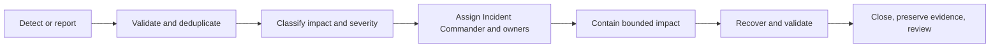

# M14.2 Production Operations Planning

**Status:** Accepted; Closed
**Date:** 2026-07-22

## Objective

Define the provider-neutral operating model for the accepted M14.1 topology.
This milestone allocates responsibility, evidence, escalation, and handover;
it does not implement telemetry, alerts, logging, automation, or runtime
behavior.

## Authority And Boundaries

- Operations owns production coordination, on-call process, incident records,
  and operational evidence custody.
- Application, Platform, Security, Knowledge, Evidence, and Intelligence owners
  remain accountable for diagnosis and decisions within their domains.
- The Product Owner owns release-impact and product-impact decisions.
- Frozen M3-M13 contracts remain unchanged. ADR-013, M14.0, and M14.1 remain
  unchanged.

No operational process may mutate Evidence, published Knowledge history,
deterministic provenance, or bypass a public port. Tool and provider selection
is outside M14.2.

## Operating States

| State | Entry condition | Decision owner | Exit evidence |
|---|---|---|---|
| Normal | Accepted release is within approved operating criteria | Operations | Current readiness and duty record |
| Degraded | One or more dependencies or capabilities miss an approved criterion while bounded service remains | Operations with owning domain | Impact record and recovery/mitigation evidence |
| Incident | User, data, security, or availability impact requires coordinated response | Incident Commander | Incident closure decision and evidence bundle |
| Maintenance | Approved bounded change is in progress | Change owner | Validation and rollback/complete decision |
| Recovery | Restore or continuity procedure is active | Recovery owner | Integrity, compatibility, and service-readiness proof |

These states define coordination semantics only. They do not add a runtime
state machine.

## Operational RACI

Roles: PO = Product Owner, OPS = Operations, APP = Application, PLAT = Platform,
SEC = Security, DOM = owning domain, IC = Incident Commander.

| Activity | PO | OPS | APP | PLAT | SEC | DOM | IC |
|---|---|---|---|---|---|---|---|
| Accept production release | A | R | C | C | C | C | I |
| Maintain duty/on-call coverage | I | A/R | C | C | C | C | I |
| Triage operational signal | I | A/R | C | C | C | C | I |
| Declare and classify incident | I | R | C | C | C | C | A |
| Diagnose application behavior | I | C | A/R | C | C | C | I |
| Diagnose topology/dependency | I | C | C | A/R | C | C | I |
| Contain security/privacy impact | I | C | C | C | A/R | C | I |
| Validate domain data/contract | I | C | C | C | C | A/R | I |
| Approve user/product trade-off | A/R | C | C | C | C | C | I |
| Coordinate incident response | I | R | C | C | C | C | A |
| Close incident and evidence | I | R | C | C | C | C | A |

Every event names one accountable role. If the normal accountable role is
unavailable, the escalation record must name the temporary authority; absence
of accountable ownership blocks risky action.

## Incident Management Flow

1. Capture source, time, affected environment/release, reporter, and initial
   symptoms without copying prohibited payloads into the incident record.
2. Validate that the event is current, identify duplicates, and bind related
   records without overwriting prior observations.
3. Classify user, data, security/privacy, contractual, provider, and operational
   impact; unknown impact is handled at the more cautious severity.
4. Assign the Incident Commander plus named technical and communication owners.
5. Select only pre-authorized containment or recovery actions. Changes outside
   a runbook require explicit authority and an auditable decision record.
6. Validate service, data integrity, compatibility, and security posture before
   returning to Normal.
7. Preserve the immutable timeline, decisions, evidence links, unresolved
   risks, and follow-up owners. Closure does not delete failed observations.

## Severity And Escalation Matrix

| Severity | Planning definition | Initial authority | Required escalation | Communication owner |
|---|---|---|---|---|
| SEV-1 | Broad unavailability, confirmed material data loss/corruption, active security/privacy compromise, or uncontrolled contract breach | Incident Commander | Immediate PO, Operations, Security, Application, Platform, affected domain | Named incident communications owner |
| SEV-2 | Material feature/dependency degradation, bounded data risk, or repeated failure without broad loss of service | Operations lead | Incident Commander and accountable technical owner; PO on product impact | Operations |
| SEV-3 | Limited impact with a known bounded workaround and no current data/security risk | Owning team | Operations when duration or scope exceeds approved criterion | Owning team |
| SEV-4 | No current user impact; operational defect or improvement item | Owning team | Normal planning process | Owning team |

Numeric response targets and communication intervals require M14.2 acceptance
plus business availability decisions; they are not invented in this milestone.
Any suspected data integrity, privacy, or active security impact is escalated to
the accountable specialist regardless of apparent service severity.

## Runbook Inventory

| Runbook ID | Planned scenario | Accountable owner | Minimum evidence before approval |
|---|---|---|---|
| OPS-RB-01 | Application instance or startup failure | Application | Detection condition, diagnosis boundary, bounded recovery, validation, abort rule |
| OPS-RB-02 | Edge or ingress degradation | Platform | Route identity, impact check, isolation path, restoration validation |
| OPS-RB-03 | Durable store unavailable or incompatible | Data/platform | Store identity, write-safety rule, recovery authority, integrity validation |
| OPS-RB-04 | External AI/provider degradation | Intelligence/integration | Capability/provider identity, disablement boundary, compatibility validation |
| OPS-RB-05 | Knowledge/publication compatibility failure | Knowledge | Publication identity, fail-closed behavior, accepted-version recovery |
| OPS-RB-06 | Evidence integrity or provenance concern | Evidence | Preservation rule, affected identity set, domain validation, escalation |
| OPS-RB-07 | Security or privacy incident | Security | Containment authority, evidence preservation, notification decision path |
| OPS-RB-08 | Release rollback | Platform/Application | Last-known-good identity, compatibility window, abort and validation gates |
| OPS-RB-09 | Backup restore or disaster recovery | Data/platform | Recovery point identity, isolation, integrity and application-readability proof |
| OPS-RB-10 | Telemetry/control-plane degradation | Operations | Blind-operation decision, risk threshold, recovery validation |

M14.2 creates no runbook implementation. Later runbooks must identify scope,
preconditions, authority, immutable inputs, steps, abort/rollback conditions,
validation, evidence location, and review expiry.

## Maintenance Windows

- Planned maintenance requires a named change owner, affected topology zones,
  immutable release/change identity, risk classification, validation plan,
  rollback/abort decision, communication owner, and approved window.
- Production changes are not combined merely because they share a window; each
  retains independent identity and evidence.
- Emergency maintenance uses the incident authority path and records why the
  normal review window could not be used.
- A window ending does not authorize incomplete work to continue. The owner
  must explicitly complete, extend through authorized escalation, or abort.
- Concrete schedules, blackout periods, and approval lead times require product
  and support commitments and remain open.

## On-Call Responsibilities

The duty owner must acknowledge handover, know the current release and topology,
hold only approved access, validate incoming signals, classify impact, engage
the correct accountable owner, maintain an append-only timeline, and ensure
unresolved risk is handed over explicitly. On-call does not grant authority to
change domain facts, bypass compatibility gates, publish Knowledge, or expose
sensitive data.

Coverage planning must define primary, secondary, Incident Commander, Security,
Platform, Application, and domain escalation contacts without storing personal
contact data in this architecture artifact.

## Operational Evidence Register

| Evidence class | Required identity | Custodian | Retention/immutability expectation |
|---|---|---|---|
| Duty record | Window, primary/secondary roles, acknowledgement | Operations | Append-only handover history |
| Operational event | Environment, release, source, time, classification | Operations | Preserve original plus later annotations |
| Incident timeline | Incident ID, ordered observations/actions/decisions | Incident Commander | Append-only; corrections are new entries |
| Change/maintenance | Change ID, artifact/config schema, owner, approvals | Change owner | Bind validation and rollback decision |
| Recovery exercise | Scenario, recovery identity, integrity/compatibility results | Data/platform | Bind failed and successful attempts |
| Readiness evidence | Gate, owner, evidence location, outcome, expiry | Operations | Release-bound and auditable |

Evidence locations and tools remain implementation choices. Sensitive payloads,
secrets, raw Evidence, and unnecessary player data are excluded; records hold
identities, classifications, decisions, and authorized evidence references.

## Audit Trail Expectations

Operational records must be attributable, timestamped, environment-bound,
release-bound, append-only, searchable by stable identity, and explicit about
authority. Corrections append a superseding entry; they never rewrite history.
Access and export are least-privilege and auditable. Retention, legal hold,
privacy erasure, and security requirements remain owned by their domains and
must be reconciled before implementation.

## KPI And SLI Definitions

| Definition | Measurement intent | Exclusions/guardrail | Later owner |
|---|---|---|---|
| Service availability | Fraction of approved service time satisfying user-serving criteria | Planned exclusions must be pre-approved and visible | Operations/Product |
| Request success | Fraction of valid user requests completing with accepted outcome | Invalid/rejected inputs classified separately, not silently discarded | Application |
| Request latency | Distribution of end-to-end completion time for declared journeys | Report by journey and release; no average-only claim | Application/Operations |
| Startup success | Fraction of authorized runtime startups reaching validated ready state | Separate configuration, dependency, and application failures | Platform/Application |
| Dependency health | Ability of each declared dependency to satisfy its contract | No inference that application correctness follows dependency health | Owning integration |
| Persistence correctness | Accepted operations without contract, integrity, or durability failure | Latency and correctness reported separately | Data/domain owners |
| Publication compatibility | Runtime use of accepted Knowledge/publication identity | Fail-closed rejection is not counted as compatible success | Knowledge |
| Incident response | Time between validated milestones in the incident timeline | Definition does not set targets or reward premature closure | Operations |
| Recovery readiness | Currency and outcome of approved restore/continuity exercises | Backup existence alone is not success | Data/platform |

Exact formulas, sampling, target objectives, error budgets, dashboards, alerts,
and instrumentation are later authorized work. No KPI may incentivize deletion,
reclassification, or suppression of valid failure evidence.

## Handover Boundaries

| Handover | Required package | Receiver may assume | Receiver must revalidate |
|---|---|---|---|
| Engineering to Operations | Release identity, topology, compatibility, known risks, runbook index | Package is the approved handover candidate | Environment readiness and evidence currency |
| Operations shift to shift | Current state, active events/incidents, pending changes, unresolved risks | Prior timeline is preserved | Access, contact coverage, current impact |
| Incident Commander to owner | Incident identity, severity, scope, decisions, open actions | Authority transfer is explicit | Current severity and owner availability |
| Recovery to normal operations | Restore identity, integrity, compatibility, security and service validation | Recovery artifacts are preserved | Normal operating criteria and residual risks |
| Operations to Product Owner | Impact, options, evidence confidence, risk and recommendation | Technical facts are owner-attested | Product trade-off and release decision |

Silence, expired evidence, or an unavailable owner is not successful handover.

## Acceptance Gates

- Every operating state and activity has an accountable owner.
- Incident flow, severity semantics, escalation, runbook inventory, maintenance,
  on-call, evidence, audit, KPI/SLI definitions, and handovers are explicit.
- Definitions do not claim targets, tooling, instrumentation, or implemented
  operational behavior.
- Frozen contracts and accepted M14 artifacts are unchanged.
- No monitoring, alerting, logging, CI/CD, scripts, infrastructure, production
  source, runtime, configuration, or additional planning artifact is added.
- Worktree changes are limited to this artifact and `MEMORY.md`.

## Engineering Evidence

- Operations inventory: 5 states, 10 runbooks, 9 KPI/SLI definitions, and 5
  handover boundaries.
- Full app regression: 881/881 tests passed.
- Knowledge package regression: 75/75 tests passed.
- Protected M3-M13 freeze regression: 44/44 tests passed.
- Architecture Fitness: 133 existing violations, 0 new violations.
- `git diff --check`: clean.
- Worktree: exactly this planning artifact and `MEMORY.md`.
- ADR-013, M14.0, M14.1, frozen, generated, production, and publication
  artifacts: unchanged.

## Product Owner Decision

Accepted and closed on 2026-07-22. M14.3 Production Recovery & Disaster
Recovery Planning is authorized next as planning-only work.
