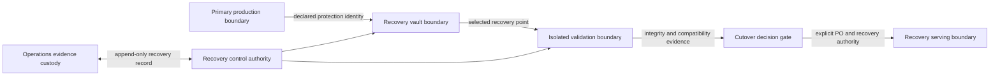

# M14.3 Production Recovery & Disaster Recovery Planning

**Status:** Accepted; Closed
**Date:** 2026-07-22

## Objective

Define provider-neutral governance for protection, restore, and disaster
recovery across the accepted M14.1 topology and M14.2 operating model. This
milestone defines ownership, evidence, states, and gates only. It implements no
storage, backup, replication, restore, failover, or runtime behavior.

## Authority And Boundaries

- Each domain owner classifies its authoritative data and validates semantic
  integrity after recovery.
- Data/Platform owns protection and restore coordination for durable stores.
- Operations owns recovery-event coordination and evidence custody.
- Security owns recovery access, isolation, credential, and compromise gates.
- Application owns compatibility and application-readability validation.
- Product Owner owns continuity trade-offs and production cutover acceptance.

Recovery cannot rewrite Evidence history, published Knowledge history, or
deterministic provenance. Frozen M3-M13 contracts and accepted M14.0-M14.2
artifacts remain unchanged.

## Recovery Invariants

1. A backup is only a candidate until an isolated restore proves integrity,
   compatibility, and application readability.
2. Recovery identities bind environment, source identity, protection point,
   release/contracts, schema/migration set, and evidence record.
3. Restore never writes over the only trusted source or the active production
   state before validation and explicit authority.
4. Rebuildable projections are recovered from authoritative history when their
   contract permits; they never become a substitute source of truth.
5. Missing, stale, mixed-environment, mixed-release, or unverifiable recovery
   evidence fails closed.
6. Recovery actions append observations and decisions; corrections do not
   delete prior attempts.

## Recoverable Information Classes

| Class | Examples | Recovery authority | Required semantic proof |
|---|---|---|---|
| Authored source | Knowledge authoring source and approved definitions | Knowledge owner | Source identity, review lineage, compiler compatibility |
| Published immutable artifact | Knowledge release/candidate/proof artifacts | Knowledge owner | Digest, version, provenance, publication compatibility |
| Authoritative event history | Evidence and other append-only domain facts | Owning domain | Ordering, identity, completeness, provenance, immutability |
| Durable operational state | Accepted configuration/state explicitly owned by a persistence port | Owning domain/Application | Schema, contract, referential and domain invariants |
| Rebuildable projection | Player, Experience, Coach, and other derived read models | Owning domain | Replay input identity, deterministic rebuild, digest comparison |
| Operational evidence | Release, incident, audit, recovery, and handover records | Operations/Security | Attribution, ordering, release/environment binding |
| Ephemeral data | Cache, temporary work, retry or local transient state | Runtime owner | Explicit declaration that loss is acceptable; no hidden authority |

Every durable item must belong to exactly one class and name one accountable
owner. Unknown classification blocks production-readiness acceptance.

## Protection Strategy By Class

| Class | Planning strategy | Required separation | Acceptance evidence |
|---|---|---|---|
| Authored source | Preserve versioned source and review lineage | Production runtime and publication output | Independent retrieval plus compile/validation proof |
| Published artifact | Retain immutable release identities and proof chain | Authoring workspace and active runtime | Digest/provenance verification |
| Event history | Preserve ordered append-only facts with integrity metadata | Active writer and recovery administration | Completeness/order/integrity verification |
| Durable operational state | Protect consistent, schema-bound recovery points | Active environment and credentials | Isolated restore plus domain validation |
| Rebuildable projection | Prefer deterministic rebuild; protect only when justified by RTO | Authoritative history | Rebuild digest and query/readability checks |
| Operational evidence | Retain immutable decision and audit records | Workload credentials and mutable dashboards | Attribution/order/access verification |
| Ephemeral data | Recreate or discard | Durable source of truth | Proven absence of authoritative-only data |

Concrete media, snapshot method, replication mode, encryption mechanism,
schedule, retention duration, and storage provider remain implementation work.

## Disaster Recovery Topology

- Primary, recovery vault, validation, and recovery-serving boundaries have
  distinct environment identities, access paths, and credentials.
- The recovery control path is separate from normal user ingress and workload
  authority.
- Validation occurs before any serving cutover. A recovery boundary cannot
  silently become production.
- Region, site, account, subscription, provider, and physical placement remain
  open until business continuity and threat evidence establish requirements.

## Recovery Governance States

| State | Entry evidence | Permitted decision | Exit gate |
|---|---|---|---|
| Protected | Current accepted protection and restore evidence exists | Continue normal operation | Evidence expiry or disruptive event |
| Protection degraded | Protection evidence is stale, missing, or failing | Bound risk, escalate, suspend risky changes | Current protection proof or DR declaration |
| Recovery declared | Authorized incident identifies scope and recovery objective | Select candidate recovery point | Candidate identity and authority validated |
| Isolated restore | Candidate is restored outside active production | Run integrity/compatibility validation | Complete validation evidence |
| Validation failed | Any mandatory check fails or evidence is ambiguous | Preserve attempt, select new candidate or abort | New authorized attempt or closure |
| Cutover ready | All mandatory validation passes | Request production cutover decision | PO and recovery authority approve/reject |
| Recovering service | Approved boundary is introduced under bounded observation | Validate serving and residual risk | Accepted recovery or abort |
| Recovered | Service/data criteria pass with recorded residual risk | Return to M14.2 Normal state | Recovery closure record |
| Aborted | Authority stops an unsafe or unnecessary recovery | Preserve evidence and restore safe posture | Incident/change owner closure |

These are governance states for a recovery record, not a new runtime state
machine or automatic failover mechanism.

## Recovery Ownership RACI

Roles: PO = Product Owner, OPS = Operations, DATA = Data/Platform, APP =
Application, SEC = Security, DOM = owning domain, RC = Recovery Coordinator.

| Activity | PO | OPS | DATA | APP | SEC | DOM | RC |
|---|---|---|---|---|---|---|---|
| Set business continuity priority | A/R | C | C | C | C | C | I |
| Classify authoritative/rebuildable data | I | C | C | C | C | A/R | I |
| Define protection/restore evidence | I | C | A/R | C | C | C | I |
| Declare recovery | I | R | C | C | C | C | A |
| Select recovery candidate | I | C | R | C | C | A | A |
| Control isolation and access | I | C | R | C | A | C | A |
| Validate infrastructure readability | I | C | A/R | C | C | C | I |
| Validate application compatibility | I | C | C | A/R | C | C | I |
| Validate domain semantics | I | C | C | C | C | A/R | I |
| Approve production cutover | A | R | C | C | C | C | R |
| Close recovery evidence | I | R | C | C | C | C | A |

No recovery step proceeds without one named accountable authority.

## RPO And RTO Governance

- Recovery Point Objective (RPO) is the maximum accepted gap between the last
  semantically valid recoverable state and the disruption point.
- Recovery Time Objective (RTO) is the maximum accepted time from authorized
  recovery declaration to validated service restoration.
- Recovery evidence age, restore duration, validation duration, and cutover
  duration are reported separately; one number cannot hide another.
- Objectives are set per information class and critical user journey, then
  approved by the Product Owner with domain, Operations, Security, and Platform
  input.
- A tighter target requires capacity, cost, isolation, security, and rehearsal
  evidence. Unsupported numeric targets are not architecture facts.

| Criticality tier | Planning meaning | Required decision before target |
|---|---|---|
| Tier 0 | Integrity or constitutional authority; corruption is never accepted as availability | Domain integrity and fail-closed rule |
| Tier 1 | User-serving authoritative state with material continuity impact | Product impact, data class, recovery dependency |
| Tier 2 | Important durable state with bounded degraded operation | Degradation policy and rebuild/restore path |
| Tier 3 | Rebuildable or replaceable state | Proven authoritative input and rebuild duration |
| Tier 4 | Ephemeral state whose loss is accepted | Explicit non-authoritative classification |

M14.3 defines no numeric RPO/RTO and claims no existing compliance.

## Recovery Validation Sequence

```mermaid
flowchart LR
  A["Authorize and scope"] --> B["Resolve exact candidate identity"]
  B --> C["Restore in isolation"]
  C --> D["Verify structural integrity"]
  D --> E["Verify contracts and schema"]
  E --> F["Verify domain semantics"]
  F --> G["Verify application readability"]
  G --> H["Rebuild and compare projections"]
  H --> I["Security and privacy gate"]
  I --> J["Cutover decision"]
  J --> K["Bounded serving validation"]
  K --> L["Close and retain evidence"]
```

Any failed step enters Validation failed and preserves the attempt. Validation
cannot skip directly from restore completion to cutover.

## Failure Scenario Matrix

| Scenario | Minimum recovery scope | Mandatory extra gate |
|---|---|---|
| Accidental logical deletion | Affected authoritative identities and dependents | Completeness plus no overwrite of surviving history |
| Corruption or incompatible migration | Last semantically valid point and schema/contracts | Root-cause isolation and migration compatibility |
| Primary store unavailable | Required information classes and serving dependencies | Write-safety and split-authority prevention |
| Site or region loss | Recovery boundary plus all critical external dependencies | Independence and capacity evidence |
| Credential compromise | Clean credentials and isolated recovery path | Security reauthorization before data access |
| Malicious or poisoned recovery point | Earlier trusted candidate | Threat containment and integrity chain |
| Published Knowledge incompatibility | Accepted release and proof chain | Publication compatibility and digest proof |
| Projection divergence | Authoritative history plus deterministic rebuild | Replay digest comparison |
| Provider dependency loss | Bounded provider-independent service posture | Contract compatibility and approved degradation |

## Recovery Evidence Bundle

The append-only bundle must include recovery ID, incident/change ID,
environment/release/contracts, disruption and declaration times, affected
information classes, candidate identities considered, selection authority,
isolation proof, ordered validation results, failed attempts, RPO/RTO
measurements, security/privacy decision, cutover decision, serving validation,
residual risks, owners, and evidence locations.

The bundle references protected data by stable identity and authorized evidence
location; it does not duplicate secrets, raw Evidence, or unnecessary player
data.

## Rehearsal And Evidence Currency

- Each declared recovery path requires an isolated rehearsal before acceptance.
- Rehearsal scope rotates across information classes and failure scenarios.
- Evidence expires after material topology, schema, contract, security,
  provider, or recovery-process change, and at an interval later approved by
  continuity owners.
- A successful prior rehearsal cannot waive a current mismatch or failed check.
- Failed rehearsals remain evidence and block the affected readiness claim until
  a verified resolution exists.

## Fail-Closed Recovery Rules

Recovery is blocked when authority, candidate identity, environment binding,
release/contract compatibility, integrity, completeness, ordering, schema,
domain validation, security approval, or cutover evidence is missing, stale,
mixed, duplicated, or ambiguous. Availability pressure cannot convert unknown
data into trusted data. Emergency decisions may accept explicit bounded service
loss, but may not fabricate or rewrite provenance.

## Acceptance Criteria

- Every information class and recovery action has one accountable owner.
- Protection, restore, DR topology, states, validation sequence, RPO/RTO
  governance, scenarios, evidence, rehearsal, and fail-closed rules are explicit.
- The plan selects no provider, product, location, storage, replication, or
  implementation mechanism and claims no recovery capability exists.
- No backup, restore, script, infrastructure, database, failover, monitoring,
  alerting, runtime, production, CI/CD, deployment, networking, persistence, or
  AI implementation is added.
- Frozen and accepted artifacts remain unchanged.
- Worktree changes are limited to this artifact and `MEMORY.md`.

## Engineering Evidence

- Recovery inventory: 7 information classes, 9 governance states, 5
  criticality tiers, 11 validation steps, and 9 failure scenarios.
- Full app regression: 881/881 tests passed.
- Knowledge package regression: 75/75 tests passed.
- Protected M3-M13 freeze regression: 44/44 tests passed.
- Architecture Fitness: 133 existing violations, 0 new violations.
- `git diff --check`: clean.
- Worktree: exactly this planning artifact and `MEMORY.md`.
- Accepted M14, frozen, generated, production, and publication artifacts:
  unchanged.

## Product Owner Decision

Accepted and closed on 2026-07-22. M14.4 Production Security Planning is
authorized next as planning-only work.
