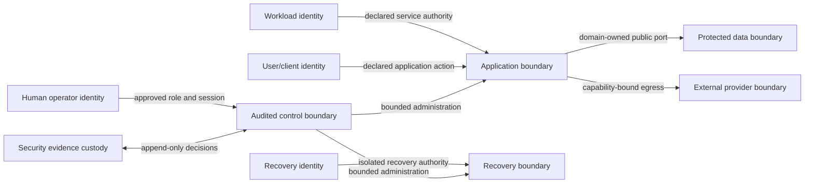

# M14.4 Production Security Planning

**Status:** Accepted; Closed
**Date:** 2026-07-22

## Objective

Define provider-neutral production security governance for the accepted M14.1
topology, M14.2 operating model, and M14.3 recovery plan. This milestone assigns
security ownership, policy, evidence, and fail-closed gates only. It implements
no identity, authorization, cryptography, certificate, secret, or security
runtime mechanism.

## Authority And Invariants

- Security owns trust policy, control evidence, exceptions, and incident
  containment governance.
- Domain owners own classification and permissible use of their data.
- Platform owns later infrastructure identity and boundary implementation.
- Application owns later enforcement at public application ports.
- Product Owner owns accepted product risk and release exceptions.

Security controls cannot grant a domain capability, rewrite Evidence or
published Knowledge history, bypass deterministic provenance, or amend frozen
M3-M13 contracts. ADR-013 and accepted M14.0-M14.3 artifacts remain unchanged.

1. Every principal, credential, resource, action, and decision is environment-
   bound and attributable.
2. Authentication establishes an identity claim; authorization independently
   decides a declared action on a declared resource.
3. Default access is denied. Missing, stale, ambiguous, cross-environment, or
   unowned policy/evidence fails closed.
4. Workloads, humans, releases, recovery processes, and external providers use
   distinct identity classes and authority.
5. Secrets and private key material never become domain facts, logs, artifacts,
   client-readable configuration, or AI session input.

## Trust Model

No identity is trusted solely because of network location. Crossing a boundary
requires declared identity class, purpose, resource, action, environment,
owner, validity window, and auditable decision.

## Identity Classes And Ownership

| Identity class | Permitted purpose | Accountable owner | Prohibited authority |
|---|---|---|---|
| User/client | Approved product actions through application entry | Product/Application | Infrastructure or domain-internal administration |
| Human operator | Time-bounded operational or administrative duty | Operations/Security | Unattributed shared access or business decisions outside role |
| Application workload | Invoke declared internal/public ports | Application | Human interactive access or environment crossover |
| Infrastructure workload | Operate a declared topology resource | Platform | Domain decisions or direct business-data interpretation |
| Release/build | Attest immutable artifact and promotion identity | Platform/Release owner | Runtime user access or mutable production authority |
| External provider | Fulfil one registered capability/contract | Integration owner | Direct domain, Evidence, or control-plane access |
| Recovery process | Perform one authorized isolated recovery | Recovery Coordinator/Security | Normal user traffic or indefinite production authority |
| Audit/evidence reader | Read approved security/operational evidence | Security/Compliance | Mutation of source records or unrelated payload access |

Identity proofing strength, lifetime, renewal, revocation, and review frequency
must match risk and be evidenced before implementation selection.

## Authentication Ownership

| Surface | Policy owner | Identity source owner | Required evidence |
|---|---|---|---|
| User-facing entry | Product/Security | Approved user identity authority | Assurance level, lifecycle, recovery and abuse review |
| Human control access | Security/Operations | Workforce identity authority | Named identity, strong assurance, session and revocation evidence |
| Workload-to-workload | Platform/Security | Environment workload authority | Workload identity, purpose, environment and rotation proof |
| Release promotion | Platform/Release owner | Build/release identity authority | Source/artifact/provenance binding and approver evidence |
| External provider | Integration/Security | Provider/account identity authority | Capability, destination, credential and revocation evidence |
| Recovery control | Recovery/Security | Isolated recovery identity authority | Incident/recovery binding, time limit and isolation proof |

M14.4 selects no authentication protocol, token format, library, provider, or
factor implementation.

## Authorization Governance

Authorization decisions are expressed as subject class, environment, action,
resource class, purpose, constraints, accountable policy owner, decision, and
evidence identity. Wildcards and inherited authority require explicit review;
absence of a declared action is denial.

| Resource class | Policy owner | Allowed decision scope | Mandatory separation |
|---|---|---|---|
| Product command/query | Application/domain owner | Public command/query contract | User authority from infrastructure administration |
| Evidence history | Evidence owner | Append/read under Evidence policy | Append from correction; no rewrite/delete through operations |
| Knowledge authoring/publication | Knowledge owner | Author/review/publish as distinct duties | Author from sole self-review/self-publication |
| Runtime configuration | Platform/Application | Approved environment/release change | Build from production change approval |
| Secret/key/certificate administration | Security/Platform | Lifecycle operations only | Material custody from usage authority where feasible |
| Operational/security evidence | Operations/Security | Append, review, export by purpose | Evidence subject from evidence approver |
| Recovery resource | Recovery/Data/Security | Declared isolated recovery action | Recovery from normal production workload identity |
| AI/provider capability | Intelligence/integration owner | Registered capability and approved data class | Provider from deterministic domain internals |

Privileged access is time-bounded, purpose-bound, independently reviewed, and
recorded. Emergency elevation appends authority and expiry; it does not erase
normal policy or create permanent privilege.

## Secret Ownership And Lifecycle

Every secret record must identify purpose, environment, consuming identity,
custodian, issuer/source, creation, activation, expiry/review, rotation,
revocation, compromise procedure, and evidence location without recording the
secret value. Shared secrets across environments or unrelated capabilities are
prohibited.

Lifecycle governance is request -> approve -> issue -> distribute through an
approved boundary -> use for declared purpose -> rotate -> revoke -> verify
removal -> retain audit evidence. Unknown ownership, unbounded lifetime,
unverifiable distribution, or suspected compromise blocks use.

## Key Management Governance

- Keys have declared cryptographic purpose, protected data class, environment,
  custodian, usage authority, lifecycle, rotation trigger, recovery rule, and
  destruction evidence.
- Signing, encryption, authentication, and wrapping purposes are distinct.
- Private material is non-exportable where the later approved risk model
  requires it; this plan selects no KMS, HSM, algorithm, or key format.
- Key recovery cannot silently weaken access separation or provenance.
- Rotation supports compatibility windows and explicit retirement validation;
  indefinitely accepting old keys is prohibited.

## Certificate Governance

Certificates bind declared identity, environment, purpose, names/scope,
issuer/authority, validity, renewal owner, revocation path, and evidence. The
inventory must prevent unknown certificates, unmanaged expiry, cross-
environment reuse, and unowned trust roots. Exact CA/provider, protocol, TLS
version, cipher, automation, and deployment remain later security engineering.

## Data Classification

| Class | Pool OS meaning | Examples | Minimum governance |
|---|---|---|---|
| Public | Explicitly approved for unrestricted publication | Public product/Knowledge material | Integrity, provenance and publication approval |
| Internal | Operational information not approved for public release | Non-sensitive topology/process metadata | Workforce-purpose access and audit as required |
| Confidential | Data whose disclosure creates user, business, or operational harm | Player/account data, detailed operational evidence | Need-to-know access, encryption policy, retention and export controls |
| Restricted | Highest-impact data or authority requiring narrowly bounded custody | Raw Evidence where sensitive, credentials, private keys, recovery material | Explicit owner, strong separation, access evidence, incident escalation |

Domain owners classify fields and flows, not just stores. Derived data inherits
the highest contributing classification unless an approved transformation and
evidence prove a lower classification. AI/provider exposure requires a separate
purpose and boundary decision; AI never receives raw internal objects by bypass.

## Encryption Policy

- Confidential and Restricted data require approved protection in transit and
  at rest, including recovery copies and operational exports where applicable.
- Integrity/authenticity requirements are defined independently from
  confidentiality.
- Termination points, plaintext exposure, key authority, failure behavior, and
  compatibility window are explicit for every protected boundary.
- Missing or invalid protection evidence fails closed; silent downgrade is
  prohibited.
- Algorithm, library, protocol, key size, provider, certificate authority, and
  implementation configuration are outside M14.4.

## Audit Policy

Security-relevant records include identity lifecycle, authentication outcome,
authorization decision, privileged access, secret/key/certificate lifecycle,
policy/exception change, release promotion, data export, recovery authority,
security event, containment, and evidence access. Records are attributable,
timestamped, environment/release-bound, append-only, integrity-protected, and
purpose-limited. They reference sensitive subjects by stable identity and must
not contain secret values or unnecessary raw payloads.

Retention, legal hold, privacy erasure, access, export, and review frequency
must reconcile Security and owning-domain policy before implementation.

## Security Evidence Register

| Evidence class | Accountable owner | Minimum contents | Blocking condition |
|---|---|---|---|
| Identity inventory | Security/identity owner | Principal class, owner, environment, status, review | Unknown or orphan identity |
| Access policy/review | Resource owner/Security | Action/resource grants, approver, expiry, review result | Unreviewed or excessive privilege |
| Secret/key/certificate inventory | Security/Platform | Purpose, custodian, lifecycle metadata, status | Unknown owner, expiry or rotation gap |
| Boundary/control assessment | Security/Platform | Boundary, threats, control intent, result, gaps | Unaccepted material gap |
| Vulnerability/dependency evidence | Application/Platform/Security | Release/artifact identity, finding, decision, expiry | Unaccepted critical finding |
| Security test/rehearsal | Security/owner | Scope, release/topology, method class, result, remediation | Missing current evidence |
| Incident evidence | Incident Commander/Security | Timeline, impact, decisions, containment, notification | Active uncontrolled impact |
| Exception record | Product Owner/Security | Risk, scope, compensating control, owner, expiry | Missing authority or expired exception |
| Compliance mapping | Compliance/control owner | Obligation, control/evidence link, gap and owner | Unsupported compliance claim |

Evidence tools, scanners, logs, and repositories are not selected here.

## Security Incident Governance

M14.2 incident flow applies with mandatory Security ownership when compromise,
unauthorized access, secret/key/certificate exposure, privacy impact, malicious
recovery point, supply-chain concern, or audit-integrity loss is suspected.
Containment preserves evidence and uses bounded pre-authorized authority.
Notification, legal, regulatory, customer, and provider decisions require named
owners and jurisdiction-specific review; this plan does not invent obligations.

Return to service requires containment, affected identity/credential handling,
integrity and compatibility validation, residual-risk acceptance, and evidence
of restored control. Apparent availability does not prove security recovery.

## Security RACI

Roles: PO = Product Owner, SEC = Security, APP = Application, PLAT = Platform,
OPS = Operations, DOM = domain owner, COMP = Compliance/Privacy owner.

| Activity | PO | SEC | APP | PLAT | OPS | DOM | COMP |
|---|---|---|---|---|---|---|---|
| Accept production security risk | A/R | C | C | C | C | C | C |
| Own trust and identity policy | I | A/R | C | C | C | C | C |
| Classify domain data/use | I | C | C | C | I | A/R | C |
| Define application authorization | I | C | A/R | C | I | C | I |
| Govern infrastructure identity | I | C | C | A/R | C | I | I |
| Govern secrets/keys/certificates | I | A | C | R | I | C | I |
| Preserve security operations evidence | I | A | C | C | R | C | C |
| Coordinate security incident | I | A | C | C | R | C | C |
| Interpret compliance/privacy duty | I | C | I | I | I | C | A/R |
| Approve expiring exception | A | R | C | C | C | C | C |

Each control and exception names one accountable owner; committee ownership
does not replace individual authority.

## Compliance Evidence Governance

Compliance claims must map a named obligation and applicability decision to an
owned control, current release/topology scope, evidence identity/location,
test/review result, gap, remediation owner, expiry, and approver. Framework
labels without evidence are not compliance. Legal and regulatory applicability
requires qualified owner review and may not be inferred from this plan.

## Fail-Closed Security Gates

Production readiness is blocked by unknown/orphan identity, missing policy
owner, excessive or cross-environment authority, stale review, unmanaged
secret/key/certificate, unclassified data flow, prohibited AI/provider exposure,
missing protection/audit evidence, uncontrolled critical finding, active
material incident, expired exception, or unsupported compliance claim. Product
risk acceptance cannot authorize violation of the Constitution or falsification
of evidence.

## Acceptance Criteria

- Trust, identity, authentication, authorization, secret, key, certificate,
  classification, encryption, audit, evidence, incident, RACI, compliance, and
  fail-closed governance are explicit and owned.
- Policies select no cloud, IAM, OAuth/OpenID, token/JWT, TLS, certificate,
  KMS/HSM, cryptographic algorithm/library, or security product.
- No crypto, authentication, authorization, security runtime, production source,
  or frozen/accepted artifact is changed or implemented.
- Worktree changes are limited to this artifact and `MEMORY.md`.

## Engineering Evidence

- Security inventory: 8 identity classes, 4 data classes, and 9 security
  evidence classes with explicit RACI and fail-closed gates.
- Full app regression: 881/881 tests passed.
- Knowledge package regression: 75/75 tests passed.
- Protected M3-M13 freeze regression: 44/44 tests passed.
- Architecture Fitness: 133 existing violations, 0 new violations.
- `git diff --check`: clean.
- Worktree: exactly this planning artifact and `MEMORY.md`.
- Accepted M14, frozen, generated, production, and publication artifacts:
  unchanged.

## Product Owner Decision

Accepted and closed on 2026-07-22. M14.5 Production Performance & Capacity
Planning is authorized next as planning-only work.
