# M14.5 Production Performance & Capacity Planning

**Status:** Accepted; Closed
**Date:** 2026-07-22

## Objective

Define provider-neutral governance for production performance, capacity, and
growth across the accepted M14.1-M14.4 plans. This milestone defines ownership,
classification, review, evidence, risk, and fail-closed gates only. It creates
no targets, measurements, benchmarks, load tests, sizing, scaling mechanism, or
runtime optimization.

## Authority And Boundaries

- Product Owner owns user-impact priorities and accepted performance trade-offs.
- Application and domain owners own workload semantics and correctness limits.
- Platform owns later resource-capacity realization and dependency constraints.
- Operations owns capacity-review coordination and evidence currency.
- Security, Data, Knowledge, and Intelligence owners validate constraints in
  their respective boundaries.

Capacity pressure cannot authorize loss of correctness, Evidence history,
published Knowledge integrity, deterministic provenance, privacy, security, or
frozen M3-M13 compatibility. Accepted M14.0-M14.4 artifacts remain unchanged.

## Performance Objective Framework

Every later objective must bind an immutable release/topology identity, named
user journey or workload class, operating condition, outcome definition,
distribution or aggregation semantics, observation window, exclusions,
accountable owner, evidence location, review expiry, and failure decision.

| Objective dimension | Planning question | Required owner |
|---|---|---|
| Responsiveness | Which user or operational journey must complete within an approved experience boundary? | Product/Application |
| Throughput | Which accepted units of useful work must be sustained without hiding failed or rejected work? | Application/domain owner |
| Concurrency | Which simultaneous workload mix must preserve correctness and isolation? | Application/Platform |
| Startup/readiness | Which authorized lifecycle milestones define ready service? | Platform/Application |
| Resource efficiency | Which resource classes and cost boundaries apply to useful work? | Platform/Product |
| Durability/integrity | Which performance trade-offs are prohibited because they weaken authoritative state? | Data/domain owner |
| Dependency resilience | Which degraded dependency conditions must remain bounded and observable? | Owning integration |
| Recovery performance | Which accepted recovery journey and validation scope is governed by M14.3? | Recovery/Data/Operations |
| Client experience | Which device-side interaction, energy, and memory constraints affect product acceptance? | Experience/Product |

M14.5 defines no numeric objective, percentile, rate, duration, budget, or
threshold. Averages alone cannot represent tail behavior or failure loss.

## Workload Classification

| Workload class | Unit of useful work | Correctness boundary | Accountable owner |
|---|---|---|---|
| Interactive command/query | One accepted user command or query journey | Public contract outcome and authorization | Application/domain owner |
| Application startup | One authorized startup reaching validated readiness | Frozen runtime/startup contracts | Application/Platform |
| Evidence ingestion/replay | One accepted fact append or deterministic replay scope | Evidence ordering, completeness, provenance | Evidence owner |
| Projection/decision pipeline | One version-bound deterministic projection through Coach outputs | Contract identity and digest stability | Owning M3 domain |
| Knowledge compile/publication | One approved candidate compile/review/publication path | Knowledge proofs and publication identity | Knowledge owner |
| External provider interaction | One registered capability invocation and accepted result | Capability/provider compatibility and data policy | Intelligence/integration owner |
| Operational/recovery action | One authorized maintenance, validation, or recovery journey | M14.2/M14.3 evidence and integrity gates | Operations/Recovery owner |
| Mixed production journey | Declared combination of user and background work | No starvation, priority inversion, or hidden correctness loss | Product/Application/Platform |

Each workload definition states included stages and failures. Retries,
rejections, timeouts, cache-like behavior, and provider delays cannot be omitted
from evidence merely to improve a result.

## Resource Classes

| Resource class | Capacity concern | Evidence owner | Guardrail |
|---|---|---|---|
| Compute scheduling | Useful work competes for execution time | Platform/Application | No hidden priority that violates workload ownership |
| Memory | Working state, immutable inputs, projections, and client/runtime overhead | Application/Experience | No dropping authoritative state or validation for capacity |
| Durable storage | Authoritative history, artifacts, operational state, recovery evidence | Data/domain owners | Retention and integrity precede optimization |
| Storage access | Read/write and restore demand across store classes | Data/Platform | Correctness and isolation remain explicit |
| Network/transport | Ingress, internal boundary, egress, and recovery transfer demand | Platform/integration owners | Security and contract boundaries remain intact |
| External dependency quota | Provider capability, availability, and usage constraints | Integration owner | No unapproved fallback or boundary bypass |
| Client device | UI responsiveness, memory, energy, connectivity, and local storage | Experience/Product | Product support scope is explicit |
| Operational capacity | On-call, incident, review, and recovery execution capacity | Operations | Human workload and escalation risk are visible |
| Cost envelope | Provider and resource cost attributable to useful work | Product/Platform | Cost does not replace reliability or integrity evidence |

No resource amount, instance shape, CPU/RAM limit, quota, product, cache, queue,
or infrastructure size is selected here.

## Scalability Assumptions

1. Pool OS remains one logical modular-monolith deployment unit; extraction is
   not a default capacity response.
2. Application-instance multiplicity may be evaluated later only when durable
   state, identity, ordering, and deterministic contracts remain valid.
3. Growth is not assumed linear. Workload mix, data history, projection depth,
   dependency behavior, recovery scope, and client constraints are reviewed
   independently.
4. A provider or dependency quota is a boundary condition, not proof of Pool OS
   capacity.
5. Release-candidate evidence must represent the accepted production topology
   and workload semantics; synthetic success alone does not establish readiness.
6. Degradation must be explicit, product-approved, reversible, and incapable of
   corrupting authoritative state or falsifying evidence.

These are review assumptions, not claims that scaling mechanisms exist.

## Capacity Ownership Model

| Capacity surface | Accountable owner | Consulted owners | Required handoff |
|---|---|---|---|
| Product journey demand | Product Owner | Application, Experience, Operations | Priorities, criticality, accepted degradation |
| Application workload model | Application | Domain owners, Platform | Work units, dependency path, correctness limits |
| Domain data growth | Owning domain | Data, Platform, Security | Authority, retention, rebuild/recovery implications |
| Runtime resource envelope | Platform | Application, Operations | Topology/release binding and capacity evidence plan |
| External capability constraints | Integration owner | Product, Platform, Security | Quota/failure contract and disablement path |
| Client support envelope | Experience/Product | Application, QA | Supported conditions and acceptance journeys |
| Operational/recovery capacity | Operations/Recovery | Platform, Security, domain owners | Coverage, exercise, and escalation assumptions |
| Cost envelope | Product Owner | Platform, integration owners | Cost attribution and trade-off authority |

Shared concern does not imply shared accountability. Every review item names
one accountable owner and an evidence expiry.

## Capacity Review Lifecycle

```mermaid
flowchart LR
  S["Scope release, topology, journeys"] --> C["Classify workloads and resources"]
  C --> O["Assign objectives and owners"]
  O --> E["Approve evidence plan"]
  E --> V["Collect later authorized evidence"]
  V --> A["Assess objectives, bottlenecks, risk"]
  A --> D["Approve, reject, or bound exception"]
  D --> R["Record decision and expiry"]
  R --> T["Trigger re-review on material change"]
```

M14.5 defines the lifecycle but performs no evidence collection or measurement.
A material release, topology, contract, schema, provider, workload, recovery,
security, product-support, or objective change invalidates affected evidence.

## Bottleneck Ownership

| Bottleneck class | Primary diagnostic owner | Decision authority | Required boundary check |
|---|---|---|---|
| Application path | Application | Application/Product | Contract correctness and user impact |
| Domain algorithm/projection | Owning domain | Domain owner/Architecture | Determinism and ownership boundary |
| Durable store/access | Data/Platform | Data/domain owner | Integrity, consistency, retention, recovery |
| Transport/edge | Platform | Platform/Security | Trust boundary and environment isolation |
| External provider/quota | Integration owner | Product/Integration | Compatibility, privacy, fallback prohibition |
| Client/device | Experience | Product/Experience | Supported-device and accessibility impact |
| Operational process | Operations | Operations/Product | Human capacity, incident and handover risk |
| Cross-boundary contention | Architecture | Product plus affected owners | No local optimization that shifts hidden risk |

A suspected bottleneck is not an authorization to optimize. The owning domain
must validate causality and compatibility through separately authorized work.

## Performance Evidence Classes

| Evidence class | Required identity and scope | Accountable custodian | Invalidating condition |
|---|---|---|---|
| Objective definition | Release/topology, journey, semantics, owner, expiry | Product/Operations | Objective or product-priority change |
| Workload model | Class, work unit, mix, dependency path, data shape | Application/domain owner | Workload or data-shape change |
| Environment equivalence | Candidate/production boundary and declared differences | Platform | Topology/configuration/dependency change |
| Validation plan | Objective-to-scenario mapping and acceptance logic | Application/Platform | Scope or objective change |
| Result record | Future authorized method, release, observations, failures, outcome | Evidence owner | Material implementation or environment change |
| Bottleneck assessment | Evidence links, causality confidence, owner, alternatives | Owning diagnostic domain | New contradictory evidence or changed path |
| Capacity decision | Gate outcomes, risk, approver, exception, expiry | Operations/Product | Expiry or material change |
| Growth forecast | Assumptions, source evidence, uncertainty, scenarios | Product/Platform | Demand or assumption change |
| Optimization proof | Separately authorized change, compatibility and regression evidence | Change owner | Further change to affected path |

This inventory does not create metrics, instrumentation, profiles, tests, or
results. Failed and inconclusive future attempts remain part of the evidence.

## Performance Validation Gates

| Gate | Required planning proof | Failure result |
|---|---|---|
| Scope identity | Exact release, topology, contracts, data/workload shape | Reject mixed or unknown scope |
| Objective authority | Named owner and approved semantics | Reject unsupported target claim |
| Workload completeness | Critical journeys, background mix, failures and degraded cases | Reject incomplete evidence plan |
| Environment relevance | Differences are declared and impact-assessed | Reject unqualified extrapolation |
| Correctness preservation | Domain, security, privacy, recovery and compatibility gates remain valid | Reject capacity claim |
| Evidence integrity | Method identity, observations, failures, provenance and expiry | Reject stale or selective evidence |
| Bottleneck ownership | One accountable owner and bounded remediation path | Block unowned optimization |
| Capacity decision | Risk, headroom concept, exceptions and re-review trigger are explicit | Block readiness approval |

Numeric pass conditions and their validation mechanisms require later Product
Owner authorization and real evidence.

## Capacity Planning RACI

Roles: PO = Product Owner, OPS = Operations, APP = Application, PLAT = Platform,
DOM = domain owner, EXP = Experience, SEC = Security.

| Activity | PO | OPS | APP | PLAT | DOM | EXP | SEC |
|---|---|---|---|---|---|---|---|
| Approve objective semantics/trade-off | A/R | C | C | C | C | C | C |
| Define workload and correctness boundary | I | C | A | C | R | C | C |
| Define resource-capacity evidence plan | I | C | C | A/R | C | C | C |
| Validate domain integrity constraints | I | I | C | C | A/R | I | C |
| Validate client experience constraints | C | I | C | C | I | A/R | I |
| Validate security/privacy constraints | I | C | C | C | C | I | A/R |
| Coordinate review and evidence custody | I | A/R | C | C | C | C | C |
| Own diagnosed bottleneck | I | C | R | R | R | R | C |
| Accept capacity risk/exception | A | R | C | C | C | C | C |
| Trigger growth re-review | A | R | C | R | C | C | C |

The bottleneck row assigns accountability to exactly the diagnosed owning
domain in a concrete review; it does not authorize multiple accountable owners.

## Performance Risk Register Structure

Each entry records stable risk ID, release/topology/workload/resource scope,
evidence links, uncertainty, user and integrity impact, dependency, trigger,
accountable owner, response options, prohibited trade-offs, accepted decision,
approver, residual risk, review date/expiry, and closure evidence. Corrections
append a superseding decision rather than rewriting history.

Required categories include demand uncertainty, data growth, mixed-workload
contention, external quotas, client constraints, recovery demand, operational
capacity, cost volatility, environment non-equivalence, stale evidence, and
unowned bottlenecks.

## Growth Planning Governance

- Growth scenarios distinguish expected, elevated, burst, degraded-dependency,
  recovery, and discontinuous product-change conditions without assigning
  numbers in M14.5.
- Forecast assumptions are explicit, evidence-linked, uncertain, and expiring.
- Review considers workload mix and authoritative-history growth, not only user
  count or request volume.
- Capacity action requires an owner, lead-time assumption, compatibility plan,
  evidence plan, rollback/abort rule, and Product Owner decision.
- Architecture extraction, caching, queuing, scaling, tuning, and optimization
  are not presumed remedies and require separately authorized evaluation.

## Fail-Closed Capacity Review

Production readiness is blocked when scope identity, objective ownership,
workload completeness, resource classification, environment relevance,
correctness constraints, evidence provenance/currency, bottleneck owner, risk
decision, or re-review trigger is missing or ambiguous. Absence of evidence is
not headroom. Passing a subset of journeys cannot stand for untested critical
workloads, and cost pressure cannot waive constitutional or domain invariants.

## Acceptance Criteria

- Objective framework, workload/resource classes, ownership, scalability
  assumptions, review lifecycle, bottlenecks, evidence, gates, RACI, risk,
  growth, and fail-closed policy are explicit.
- No numeric objective, benchmark, load/stress test, measurement, profile,
  metric, dashboard, autoscaling, sizing, CPU/RAM limit, infrastructure/cloud
  product, cache, queue, tuning, or optimization is introduced.
- No production/runtime source, Flutter, network, AI, database, frozen/accepted
  artifact, ADR, or additional planning document is changed.
- Worktree changes are limited to this artifact and `MEMORY.md`.

## Engineering Evidence

- Planning inventory: 9 objective dimensions, 8 workload classes, 9 resource
  classes, 9 review stages, 9 evidence classes, and 8 validation gates.
- Full app regression: 881/881 tests passed.
- Knowledge package regression: 75/75 tests passed.
- Protected M3-M13 freeze regression: 44/44 tests passed.
- Architecture Fitness: 133 existing violations, 0 new violations.
- `git diff --check`: clean.
- Worktree: exactly this planning artifact and `MEMORY.md`.
- Accepted M14, frozen, generated, production, and publication artifacts:
  unchanged.

## Product Owner Decision

Accepted and closed on 2026-07-22. M14.6 Production Acceptance & Operational
Readiness Planning is authorized next as planning-only work.
