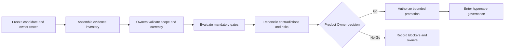

# M14.6 Production Acceptance & Operational Readiness Planning

**Status:** Accepted; Closed
**Date:** 2026-07-22

## Objective

Define the evidence-bound governance for accepting, releasing, observing, and
closing a production release candidate. This milestone composes accepted
M14.1-M14.5 plans into owned Go/No-Go, rollback, hypercare, and post-release
decisions. It implements no deployment, test, monitoring, automation, or
production behavior.

## Authority And Invariants

- Product Owner is accountable for the final Go/No-Go and product trade-offs.
- Release Manager coordinates the immutable candidate and evidence package.
- Architecture, Application, Platform, Operations, Security, Data/Recovery,
  Knowledge, Intelligence, and domain owners attest only their owned gates.
- Missing, stale, mixed-release, mixed-environment, contradictory, unowned, or
  unverifiable mandatory evidence is No-Go.
- A release decision cannot amend the Constitution, frozen M3-M13 contracts,
  Evidence history, Knowledge publication history, or deterministic provenance.

Accepted M14.0-M14.5 artifacts remain unchanged.

## Release Candidate Identity

Every acceptance record binds source revision, immutable artifact identity,
environment/topology identity, configuration schema identity, migration set,
Knowledge release/proof identity, runtime contract/freeze identities, external
provider compatibility identities, evidence-package identity, owner roster,
decision time, and expiry/review conditions. Promotion uses the same accepted
artifact; rebuilding creates a new candidate and invalidates prior acceptance.

## Production Readiness Gates

| Gate | Required owned evidence | Accountable owner | Fail result |
|---|---|---|---|
| Candidate identity | Complete immutable release/provenance binding | Release Manager | No-Go |
| Architecture/topology | M14.1 environment, zone, trust and route acceptance | Architecture/Platform | No-Go |
| Functional/contracts | Accepted user journeys and protected contract/freeze evidence | Application/domain owners | No-Go |
| Operations | M14.2 duty, incident, escalation, handover and evidence readiness | Operations | No-Go |
| Recovery/DR | M14.3 current isolated restore/recovery evidence and residual risk | Data/Recovery | No-Go |
| Security/privacy | M14.4 identity, access, data, incident and exception evidence | Security/Privacy | No-Go |
| Performance/capacity | M14.5 owned objective, workload, capacity and risk decision | Product/Platform | No-Go |
| Knowledge/publication | Current accepted publication identity and proof chain | Knowledge owner | No-Go |
| External dependencies | Compatibility, ownership, bounded failure and disablement evidence | Integration owners | No-Go |
| Rollback/recovery readiness | Last-known-good identity, compatibility and decision authority | Release/Recovery owners | No-Go |
| Product acceptance | Critical journey, known limitation and support impact decision | Product Owner | No-Go |

Passing one gate cannot compensate for a failed mandatory gate.

## Go / No-Go Decision Process

Allowed decisions are Go or No-Go. A bounded exception is input evidence to a
gate, not a third decision state; it names scope, risk, compensating control,
owner, approvers, expiry, abort trigger, and resolution. Exceptions cannot waive
constitutional, integrity, privacy, security, or frozen-contract violations.

## Acceptance Ownership RACI

Roles: PO = Product Owner, RM = Release Manager, OPS = Operations, APP =
Application, PLAT = Platform, SEC = Security, DOM = owning domain.

| Activity | PO | RM | OPS | APP | PLAT | SEC | DOM |
|---|---|---|---|---|---|---|---|
| Freeze candidate/evidence identity | I | A/R | C | C | C | C | C |
| Attest owned gate | I | C | R | R | R | R | R |
| Validate evidence inventory/currency | I | A/R | C | C | C | C | C |
| Reconcile cross-gate contradiction | C | R | C | C | C | C | C |
| Accept product risk and Go/No-Go | A/R | C | C | C | C | C | C |
| Authorize bounded promotion | A | R | C | C | R | C | I |
| Decide rollback/abort | A | R | R | C | C | C | C |
| Coordinate hypercare | I | C | A/R | C | C | C | C |
| Accept hypercare exit | A | R | R | C | C | C | C |
| Close post-release review | A | R | C | C | C | C | C |

In a concrete gate, exactly one named owner supplies the attestation; the RACI
does not create collective accountability.

## Acceptance Evidence Inventory

| Evidence class | Required binding | Custodian | Invalidated by |
|---|---|---|---|
| Candidate manifest | Source/artifact/configuration/migration/contracts | Release Manager | Any candidate component change |
| Gate attestation | Gate, scope, owner, result, evidence links, expiry | Gate owner | Evidence expiry or scope change |
| Known-risk register | Risk, impact, owner, decision, trigger, residual risk | Product/Release | New evidence or expired decision |
| Exception record | Scope, authority, compensation, expiry, resolution | Security/Release | Expiry or compensating-control failure |
| Decision record | Candidate, gate summary, Go/No-Go, approvers, time | Product Owner | Never reused for another candidate |
| Promotion record | Candidate, target environment, authority, observation scope | Release Manager | Target/candidate mismatch |
| Rollback decision | Trigger, last-known-good identity, compatibility, authority | Release/Recovery | Changed compatibility or target |
| Hypercare record | Entry, observations, decisions, owners, exit evidence | Operations | Open blocker or missing exit gate |
| Post-release review | Outcomes, incidents, evidence gaps, lessons/actions | Release Manager | Append corrections only |

Evidence is append-only and references sensitive sources by authorized identity;
it does not duplicate secrets, raw Evidence, or unnecessary player data.

## Operational Readiness Checklist Structure

Each checklist item has stable ID, gate, candidate/topology scope, requirement,
accountable owner, evidence location and digest/identity where applicable,
status, reviewer, decision time, expiry, blocking rule, exception link, and
resolution. Status values are notStarted, readyForReview, passed, failed,
expired, or superseded. Superseding appends a new record.

Checklist sections are candidate identity, ownership, topology, contracts,
functional/product, operations, recovery, security/privacy, performance/
capacity, Knowledge, external dependencies, rollback, communications,
hypercare, and final sign-off. M14.6 creates no executable checklist tool.

## Release Approval Workflow

1. Release Manager freezes candidate identity and acceptance scope.
2. Named gate owners submit current attestations against that exact scope.
3. Release Manager validates completeness, identity, currency, and conflicts.
4. Owners resolve failed gates or explicitly retain them as blockers.
5. Product Owner reviews gate outcomes, known risks, exceptions, rollback,
   communications, and hypercare commitments.
6. Product Owner records Go or No-Go. Go includes target, bounded promotion
   scope, abort authority, observation responsibility, and evidence identity.
7. Any candidate or material evidence change restarts affected approval gates.

Approval is not inferred from silence, meeting attendance, or previous release.

## Rollback Decision Governance

Before Go, the record identifies last-known-good release, compatible
configuration/migration window, authoritative data constraints, Knowledge and
provider compatibility, recovery relationship, abort triggers, decision owner,
validation requirements, and forward-repair alternatives. Rollback never
rewrites Evidence or published Knowledge history and cannot be declared safe
without data/schema compatibility evidence.

During promotion or hypercare, the Release Manager and Operations recommend
continue, pause, or rollback/abort based on declared triggers; the named
authority decides and records rationale. Unknown integrity/security impact
defaults to containment and No-Go for further expansion.

## Production Sign-Off Responsibilities

| Sign-off | Attests | Does not attest |
|---|---|---|
| Product Owner | Product risk, critical journeys, limitations, Go/No-Go | Technical evidence outside owner attestations |
| Release Manager | Candidate/evidence completeness and approval process | Domain correctness |
| Application/domain owners | Owned behavior, contracts and semantic correctness | Infrastructure/security outside their scope |
| Platform | Topology, promotion boundary and infrastructure readiness evidence | Product value or domain policy |
| Operations | Duty, incident, handover, hypercare and evidence custody | Security or data semantics |
| Security/Privacy | Owned security, data-use, exception and incident gates | Product acceptance |
| Data/Recovery | Integrity, restore/recovery and compatibility evidence | Unrelated application behavior |

Sign-off is attributable and candidate-bound; proxy authority is explicit.

## Deployment Communication Plan

The plan defines audience class, purpose, owner, approved content, release and
environment identity, timing trigger, channel class, acknowledgement need,
escalation, correction method, and retention. Audiences include release owners,
on-call, support, security/privacy, domain owners, product stakeholders, and
affected users when Product Owner policy requires it.

Communications never include secrets or unnecessary sensitive payloads. A
correction appends and clearly supersedes prior information. M14.6 selects no
channel or automation.

## Hypercare Governance

Hypercare begins only after an authorized Go and bounded production promotion.
Entry records candidate identity, observation scope, named coordinator, duty
coverage, known risks, change constraints, escalation/rollback authority,
evidence locations, review cadence category, and exit criteria. This plan
creates no monitoring, dashboard, metric, runtime check, or runbook.

During hypercare, new events, incidents, risks, changes, decisions, and user
impact append to the release record. Expansion or unrelated change cannot hide
release-specific evidence. Material unknown impact pauses expansion and invokes
the appropriate M14.2-M14.4 governance.

## Hypercare Exit Criteria

- All mandatory acceptance gates remain current for the promoted scope.
- No open uncontrolled integrity, security/privacy, recovery, capacity, or
  critical product-impact blocker remains.
- Declared observation and support commitments are complete.
- Incidents and deviations have owners, decisions, and evidence.
- Residual risks and follow-ups are explicitly accepted by accountable owners.
- Normal M14.2 operational handover is acknowledged.
- Product Owner and Release/Operations owners record exit acceptance.

Elapsed time alone is never sufficient exit evidence.

## Post-Release Review Governance

The review binds the release and evidence package and records planned versus
actual governance outcomes, gate quality, incidents, rollback decisions,
security/recovery/capacity observations, user/support impact, evidence gaps,
exceptions, residual risks, and owned actions. It reviews decision quality
without rewriting the original record or treating absence of incidents as
proof that every gate was effective.

## Lessons-Learned Capture

Each lesson records observation, supporting evidence, affected boundary/gate,
impact, contributing condition, confidence, proposed change, accountable owner,
priority decision, due/review condition, validation evidence required, and
closure status. Lessons are not architecture amendments or implementation
authorization. Durable changes follow the Constitution and separately approved
milestones.

## Fail-Closed Readiness Policy

No-Go applies when candidate identity, accountable owner, mandatory gate,
evidence provenance/currency, contradiction resolution, rollback decision,
communications owner, hypercare commitment, or sign-off is missing or
ambiguous. A deadline, sunk cost, prior success, or partial gate pass cannot
convert unknown readiness into Go.

## Acceptance Criteria

- Readiness, Go/No-Go, ownership, evidence, checklist, approval, rollback,
  sign-off, communications, hypercare, exit, review, and lessons governance are
  explicit and candidate-bound.
- No deployment/CI/CD/release tooling, rollout automation, production behavior,
  monitoring/dashboard/metric, runtime check, smoke/acceptance test, runbook,
  infrastructure, production source, ADR, or extra planning document is added.
- Frozen M3-M13 and accepted M14.0-M14.5 artifacts remain unchanged.
- Worktree changes are limited to this artifact and `MEMORY.md`.

## Engineering Evidence

- Readiness inventory: 11 mandatory gates, 9 evidence classes, and 7 sign-off
  roles with binary Go/No-Go and fail-closed governance.
- Full app regression: 881/881 tests passed.
- Knowledge package regression: 75/75 tests passed.
- Protected M3-M13 freeze regression: 44/44 tests passed.
- Architecture Fitness: 133 existing violations, 0 new violations.
- `git diff --check`: clean.
- Worktree: exactly this planning artifact and `MEMORY.md`.
- Accepted M14, frozen, generated, production, and publication artifacts:
  unchanged.

## Product Owner Decision

Accepted and closed on 2026-07-22. M14.7 Production Readiness Final Gate
Planning is authorized next as planning-only work.
