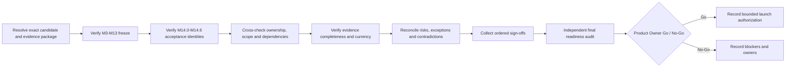

# M14.7 Production Readiness Final Gate Planning

**Status:** Accepted; Closed
**Date:** 2026-07-22

## Objective

Define the final, provider-neutral governance gate that determines whether an
immutable Pool OS release candidate is authorized for a bounded production
launch. This milestone consolidates accepted M14.0-M14.6 planning evidence; it
does not deploy, execute, validate at runtime, automate, or modify production.

## Final Gate Invariants

1. The Product Owner is the sole final Go/No-Go authority, supported by named
   gate-owner attestations; no tool or committee implies approval.
2. Every record binds one exact candidate, topology, environment, contract/
   freeze set, Knowledge release, configuration schema, migration set, provider
   compatibility set, and evidence package.
3. All mandatory criteria pass. Missing, stale, contradictory, mixed-scope,
   unowned, unverifiable, or expired evidence is No-Go.
4. Risk acceptance and exceptions cannot amend the Constitution, frozen M3-M13
   contracts, domain ownership, Evidence/Knowledge history, privacy, security,
   or deterministic provenance.
5. Any candidate or material scope change invalidates affected approvals and
   requires a new final-gate evaluation.

Accepted M14.0-M14.6 and frozen M3-M13 artifacts remain unchanged.

## Consolidated Acceptance Criteria

| Final criterion | Required source | Accountable attestor | Final-gate failure |
|---|---|---|---|
| Planning authority | Accepted M14.0 scope, sequence and ADR-013 status | Product Owner/Architecture | No-Go |
| Topology identity | Accepted M14.1 environment, zones, boundaries, routes and owners | Architecture/Platform | No-Go |
| Operational readiness | Accepted M14.2 ownership, incident, duty, evidence and handover plan | Operations | No-Go |
| Recovery readiness | Accepted M14.3 protection, restore, validation and continuity governance | Data/Recovery | No-Go |
| Security/privacy readiness | Accepted M14.4 identity, access, data, evidence and incident governance | Security/Privacy | No-Go |
| Performance/capacity readiness | Accepted M14.5 objectives, workload, capacity, evidence and risk governance | Product/Platform | No-Go |
| Acceptance/launch readiness | Accepted M14.6 gates, evidence, rollback, communication and hypercare plan | Release Manager/Operations | No-Go |
| Candidate integrity | Immutable source/artifact/configuration/migration identity and provenance | Release Manager | No-Go |
| Frozen foundations | Protected M3-M13 manifests/proofs/tests match accepted baseline | Architecture/Application | No-Go |
| Knowledge/publication | Accepted Knowledge identity, digest, proofs and compatibility | Knowledge owner | No-Go |
| Domain/contract behavior | Owned contract and critical-journey acceptance evidence | Application/domain owners | No-Go |
| External dependencies | Capability/provider identity, compatibility, data policy and bounded failure | Integration owners | No-Go |
| Rollback/recovery authority | Last-known-good identity, compatibility, triggers and owners | Release/Recovery owners | No-Go |
| Evidence integrity | Complete append-only inventory, provenance, currency and custody | Final Readiness Auditor | No-Go |
| Product decision | User impact, known risks, support and launch scope accepted | Product Owner | No-Go |

No criterion can be averaged, ranked, or compensated by another criterion.

## Cross-Milestone Readiness Verification

Verification checks identity and governance evidence only. M14.7 adds no test,
runtime validation, script, or automation.

## Release Authorization Authority

| Authority | May authorize | May not authorize |
|---|---|---|
| Product Owner | Final bounded production Go/No-Go and accepted product risk | Constitutional/frozen-contract violation or fabricated evidence |
| Gate owner | Pass/fail attestation for owned criterion | Another owner's domain or final launch |
| Release Manager | Candidate freeze, evidence assembly and approved promotion scope | Product risk or silent evidence waiver |
| Operations | Operational/hypercare readiness and pause recommendation | Domain correctness or security exception |
| Security/Privacy | Security/privacy gate and owned exception recommendation | Product launch alone |
| Recovery/Data | Integrity, recovery and rollback compatibility attestation | Application/product acceptance |
| Final Readiness Auditor | Independent completeness/conflict finding | Go decision or evidence mutation |

Delegation is named, bounded, time-limited, and recorded before use.

## Evidence Completeness Verification

The final evidence index records stable item ID, criterion, exact candidate/
topology/environment scope, evidence type, source owner, custodian, immutable
identity or digest where applicable, location, result, reviewer, creation and
expiry, dependencies, supersession, exception/risk links, and conflict status.

Completeness requires every mandatory criterion to have one current owner
attestation, reachable evidence, resolved dependencies, no unresolved conflict,
and no orphan or duplicate semantic identity. Presence of a link alone is not
evidence quality. Corrections append and supersede; they do not overwrite.

## Risk Acceptance Governance

Each risk record binds candidate/scope, source evidence, affected criteria and
boundaries, likelihood/impact semantics, uncertainty, user/integrity/security/
privacy/recovery consequences, owner, response options, prohibited trade-offs,
residual risk, approver, decision, trigger, expiry, and resolution evidence.

Only the Product Owner accepts product risk. Technical owners attest facts and
constraints. Unknown integrity, active security/privacy compromise, frozen-
contract drift, or missing mandatory evidence is a blocker, not an acceptable
risk entry.

## Exception Approval Process

1. Gate owner records the exact failed requirement and evidence.
2. Security/Architecture/domain owners classify whether an exception is legally
   and constitutionally permissible.
3. The proposal defines narrow scope, duration, compensating governance,
   accountable owner, detection evidence, abort trigger, resolution, and expiry.
4. Required technical and Product Owner approvers explicitly accept or reject.
5. Accepted exception is linked to the criterion, risk, launch and hypercare
   records and remains visible as residual risk.
6. Expiry or compensation failure invalidates the affected gate.

An exception never changes a failed fact into passed evidence.

## Production Launch Decision Record

The append-only record contains decision ID, candidate/evidence identities,
target environment and bounded launch scope, gate summary, signatories and
authority, risks/exceptions, known limitations, rollback/recovery identity,
communication and hypercare owners, observation/abort governance, decision time,
expiry, Go/No-Go, rationale, and superseding decision link. It contains no
credentials or unnecessary sensitive payloads.

## Final Readiness Audit

The auditor is independent of final product approval and verifies exact scope,
owner coverage, acceptance status, freeze identity, evidence provenance and
currency, dependency completeness, contradictions, exception authority,
rollback/recovery readiness, communication/hypercare ownership, and decision-
record completeness. Findings are pass, fail, or evidenceMissing; only pass
permits the Product Owner to consider Go.

Audit corrections append new findings. Audit does not self-approve its own
evidence and cannot execute a release.

## Readiness Sign-Off Sequence

1. Release Manager attests candidate and evidence-index identity.
2. Architecture attests Constitution, topology and frozen-foundation integrity.
3. Application and domain owners attest owned contracts and critical behavior.
4. Knowledge and integration owners attest publication/provider compatibility.
5. Data/Recovery attests integrity, recovery and rollback compatibility.
6. Security/Privacy attests owned controls, incidents and exceptions.
7. Operations attests duty, incident, communications and hypercare readiness.
8. Platform attests target/topology and bounded promotion readiness.
9. Final Readiness Auditor attests completeness and conflict resolution.
10. Product Owner records final Go or No-Go.

Order exposes dependencies; earlier sign-off is invalidated by a material later
change to its scope.

## Freeze Verification Before Release

The final gate verifies accepted M3-M13 manifest/proof identities, deterministic
contract-set digests, protected suite outcomes, Architecture Fitness ratchet,
Knowledge/publication proof identity, Golden/reference/protected artifact
status, and candidate source/artifact provenance. M14.7 performs no new test or
freeze generation; it consumes separately produced accepted evidence.

Any drift, regenerated mismatch, unexpected protected change, or inability to
reproduce the accepted identity is No-Go and requires separately authorized
resolution.

## Production Launch Governance

A Go authorizes only the candidate, target, scope, owner roster, promotion
boundary, risk/exception set, communication plan, hypercare commitment, and
abort/rollback authority recorded in the decision. It does not authorize extra
features, unrelated changes, broader rollout, new providers, or infrastructure.

Launch expansion requires the M14.6 gates to remain current and the recorded
authority to approve the next bounded scope. New material risk, contradiction,
unknown integrity/security impact, expired evidence, or abort trigger pauses
expansion and invokes No-Go/rollback governance. M14.7 does not execute launch.

## Final Gate Outputs

The governance process may produce only a completed evidence index, final audit
record, ordered sign-offs, risk/exception references, and one candidate-bound
Go/No-Go launch decision record in later authorized execution. This planning
artifact itself creates none of those production records.

## Fail-Closed Final Gate

Final status is No-Go unless all fifteen consolidated criteria pass, every
required sign-off is current, the independent audit passes, and the Product
Owner explicitly records Go. Deadline, cost, previous release success, partial
rollout, absence of observed incidents, or informal consent cannot substitute
for evidence.

## Acceptance Criteria

- Final gate, consolidated criteria, cross-milestone verification, authority,
  evidence completeness, risk/exception, decision record, audit, sign-off,
  freeze verification, and launch governance are explicit and fail closed.
- No deployment/release execution, production runtime, CI/CD, infrastructure,
  monitoring, test/runtime validation, automation, script, production source,
  ADR, or additional planning document is introduced.
- Frozen M3-M13 and accepted M14.0-M14.6 artifacts remain unchanged.
- Worktree changes are limited to this artifact and `MEMORY.md`.

## Engineering Evidence

- Final-gate inventory: 15 mandatory criteria, 10 ordered sign-offs, independent
  audit, and binary fail-closed Go/No-Go governance.
- Full app regression: 881/881 tests passed.
- Knowledge package regression: 75/75 tests passed.
- Protected M3-M13 freeze regression: 44/44 tests passed.
- Architecture Fitness: 133 existing violations, 0 new violations.
- `git diff --check`: clean.
- Worktree: exactly this planning artifact and `MEMORY.md`.
- Accepted M14, frozen, generated, production, and publication artifacts:
  unchanged.

## Product Owner Decision

Accepted and closed on 2026-07-22. M14.0-M14.7 are accepted and M14 Production
Readiness & Release Planning is closed. M15.0 Production Readiness
Implementation Planning is authorized next as planning-only work.
