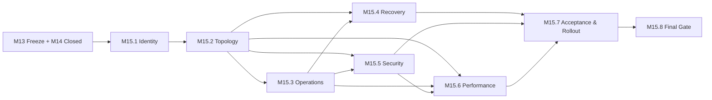

# M15.0 Production Readiness Implementation Planning

**Status:** Accepted; Closed
**Date:** 2026-07-22

## Objective

Translate the accepted M14 production-readiness governance into an ordered,
provider-neutral implementation roadmap. M15.0 authorizes planning only. It
does not implement production behavior, infrastructure, deployment, telemetry,
security controls, recovery, performance validation, tests, or runtime changes.

## Authority And Inputs

- M13 Foundation Freeze remains the protected runtime baseline.
- M14.0-M14.7 are accepted governance inputs and remain unchanged.
- ADR-013 remains Proposed and supplies production-readiness governance context.
- ADR-014 is Proposed and cannot authorize implementation by itself.
- The Product Owner must separately authorize every executable M15 capability.

No cross-domain contract is changed by M15.0.

## Capability Decomposition

| Capability | Planned outcome | Depends on |
|---|---|---|
| M15.1 Release Identity & Provenance Implementation | Reproducible candidate identity and evidence linkage | M13 Freeze, M14.7 |
| M15.2 Environment & Topology Implementation | Accepted M14.1 boundaries realized without domain leakage | M15.1 |
| M15.3 Operational Readiness Implementation | Telemetry/evidence, incident and duty mechanisms for accepted topology | M15.2 |
| M15.4 Data Protection & Recovery Implementation | Protection, isolated restore and recovery evidence | M15.2, M15.3 |
| M15.5 Security Controls Implementation | Identity, access, secret/key/certificate and audit controls | M15.2, M15.3 |
| M15.6 Performance & Capacity Validation | Authorized workload evidence and capacity decisions | M15.2, M15.3, M15.5 |
| M15.7 Acceptance & Rollout Implementation | Candidate-bound gates, rollback, communications and hypercare evidence | M15.4-M15.6 |
| M15.8 Production Readiness Final Gate Execution | Independent audit and Product Owner Go/No-Go record | M15.7 |

The graph has nine nodes, fourteen directed edges, and zero cycles.

## Implementation Sequence

1. Establish immutable candidate and evidence identity before selecting or
   configuring production mechanisms.
2. Realize environment isolation and topology boundaries before operational,
   recovery, security, or capacity controls depend on them.
3. Establish operational evidence custody before recovery/security exercises
   and performance evidence are accepted.
4. Implement recovery and security as separately owned capabilities; neither
   may bypass domain ports or infer authority from topology.
5. Validate performance only against accepted identity, topology, operations,
   security, workload semantics, and correctness gates.
6. Implement acceptance/rollout only after recovery, security, and performance
   evidence passes for the same candidate scope.
7. Execute the independent final gate last. Missing evidence is No-Go.

Parallel work is allowed only for graph-independent nodes and separately
authorized files. Shared worktree convenience does not broaden scope.

## Ownership Boundaries

| Concern | Accountable owner | Required public boundary |
|---|---|---|
| Candidate identity/provenance | Release/Platform | Existing build, publication and frozen-contract identities |
| Topology/environment | Platform/Architecture | M13 public runtime/adapter boundaries |
| Operational evidence | Operations | Sanitized, purpose-bound observation/control ports |
| Domain data/recovery | Data plus owning domain | Domain-owned persistence/replay ports |
| Security controls | Security/Platform/Application | Declared identity, resource and public application boundaries |
| Workload/capacity | Product/Application/Platform | Accepted user journeys and domain correctness contracts |
| Acceptance/rollout | Release Manager/Product Owner | Candidate-bound evidence index and decisions |
| Final gate | Product Owner/independent auditor | M14.7 final-gate schema and accepted evidence |

Infrastructure implementations may consume domain contracts but never own
domain semantics, Coach policy, Evidence truth, or Knowledge publication.

## Implementation Evidence Gates

Every future capability must report exact authorized files, owner/domain and
cross-domain contracts, source/artifact identity, focused verification,
regression, protected freeze status, Architecture Fitness, security/privacy
impact, rollback/disablement path, generated-artifact status, and PO decision.

Evidence is candidate-bound, append-only, reproducible, and expires on material
source, contract, topology, configuration, provider, schema, or policy change.

## Rollback Governance

- Each capability defines preconditions, compatibility window, last-known-good
  identity, disablement/rollback authority, abort triggers, data implications,
  validation, and evidence retention before implementation.
- Rollback never rewrites Evidence or published Knowledge history.
- Schema/data changes prefer forward repair when reversal would lose facts.
- An implementation without a proven bounded recovery or disablement path is
  not ready to feed a dependent capability.

## Verification Strategy

Verification scales by capability risk and includes focused contract/unit
tests, integration evidence where authorized, full app and Knowledge
regression, protected M3-M13 freeze suites, Architecture Fitness, generated and
protected artifact checks, and `git diff --check`. Production signals and
exercises are required only when their implementing milestone is separately
authorized; M15.0 creates none.

## Definition Of Done

- Future capabilities, dependencies, owners, boundaries, evidence, rollback,
  verification, and acceptance sequence are explicit and acyclic.
- ADR-014 is Proposed and cites normative authority plus M14 evidence.
- Exactly four authorized M15.0 files change.
- No production/runtime source, frozen/accepted artifact, infrastructure,
  deployment, CI/CD, monitoring, test implementation, or new runtime contract
  is introduced.
- Existing regression, protected freeze, Architecture Fitness, and diff checks
  remain unchanged.

## Engineering Evidence

- Capability graph: 8 M15 capabilities, 9 total nodes, 14 directed edges, and
  0 cycles.
- Full app regression: 881/881 tests passed.
- Knowledge package regression: 75/75 tests passed.
- Protected M3-M13 freeze regression: 44/44 tests passed.
- Architecture Fitness: 133 existing violations, 0 new violations.
- `git diff --check`: clean.
- Worktree: exactly the four authorized M15.0 artifacts.
- Frozen, accepted M14, generated, production, and publication artifacts:
  unchanged.

## Product Owner Decision

Accepted and closed on 2026-07-22. M15.1 Production Identity & Release Artifact
Implementation Planning is authorized next as planning-only work.
