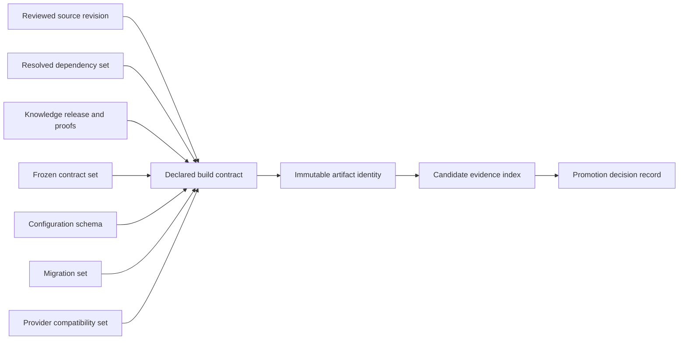
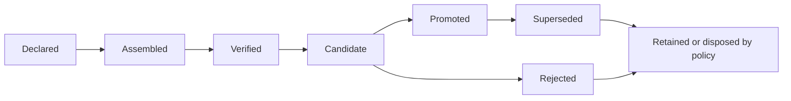

# M15.1 Production Identity & Release Artifact Implementation Planning

**Status:** Accepted; Closed
**Date:** 2026-07-22

## Objective

Define the implementation plan and governance contract for immutable production
artifact identity, provenance, promotion, retention, traceability, rollback,
and lifecycle evidence. This milestone remains planning-only and creates no
artifact, hash, signature, build/package process, storage, CI/CD, or runtime
behavior.

## Authority And Invariants

- Release/Platform owns artifact identity assembly and custody planning.
- Source, Knowledge, contract/freeze, configuration, migration, Security, and
  domain owners attest only their owned inputs.
- Product Owner authorizes promotion and accepted retention/risk policy.
- One artifact identity binds one exact immutable content set and provenance
  chain; changed content always creates a new identity/version.
- Missing, mixed, mutable, stale, orphan, duplicate, or unverifiable input fails
  closed and cannot be promoted.

Frozen M3-M13, accepted M14, and accepted M15.0 artifacts remain unchanged.

## Production Artifact Identity Model

| Identity field | Meaning | Accountable source |
|---|---|---|
| artifactId | Stable semantic identity of the candidate artifact | Release owner |
| artifactVersion | Declared immutable release version | Product/Release |
| artifactDigest | Future canonical content-integrity value | Build/Release |
| sourceRevision | Exact reviewed source identity | Source-control owner |
| dependencySetIdentity | Exact resolved dependency input set | Build/Platform |
| buildContractVersion | Build/reproducibility contract identity | Build owner |
| configurationSchemaIdentity | Compatible configuration shape, never secret values | Application/Platform |
| migrationSetIdentity | Exact applicable migration set | Data/domain owners |
| knowledgeIdentity | Accepted Knowledge release, digest and proof | Knowledge owner |
| frozenContractSetIdentity | Accepted M3-M13 freeze identities | Architecture |
| providerCompatibilitySet | Declared external capability/provider compatibility | Integration owners |
| evidenceIndexIdentity | Candidate-bound evidence inventory | Release Manager |
| createdAt | Artifact record creation instant | Release evidence authority |
| provenanceIdentity | Canonical identity of the complete provenance chain | Release owner |

The future model is immutable, versioned, canonical, deterministic for the
same inputs, and contains identities rather than source payloads or secrets.
M15.1 does not introduce a runtime contract or production implementation.

## Artifact Versioning Policy

- Version changes whenever executable/package content or a compatibility-
  relevant declared input changes.
- Rebuilding the same version is accepted only if separately authorized
  reproducibility evidence proves identical canonical content identity.
- Configuration values and secrets are environment state, not artifact content;
  their schema/compatibility identity is bound separately.
- Knowledge, frozen-contract, migration, dependency, or provider-compatibility
  changes cannot reuse prior acceptance merely because application source did
  not change.
- Version aliases or channels may reference an immutable identity but cannot
  replace it as audit evidence.
- Version policy and compatibility semantics require explicit Product Owner and
  owning-domain approval before implementation.

No version string, SemVer increment, or production number is chosen here.

## Provenance Chain

Every edge is explicit, attributable, reproducible, and scope-bound. The chain
does not infer ownership from IDs, filenames, storage paths, tags, or deployment
location.

## Integrity Verification Planning

Future verification must canonicalize declared inputs, validate completeness
and uniqueness, independently recompute content/provenance identities, compare
expected and observed identities, prove referenced evidence is reachable and
current, and reject mutation after identity creation. Verification must retain
failures and cannot trust a producing system's self-attestation alone.

Integrity checks distinguish artifact bytes, provenance inputs, metadata,
signature/attestation evidence, and storage/transport observations. Passing one
does not imply the others. Algorithms, formats, signing, and tools remain later
implementation choices.

## Release Artifact Ownership RACI

Roles: PO = Product Owner, RM = Release Manager, BUILD = Build/Platform, ARCH =
Architecture, DOM = input domain owner, SEC = Security.

| Activity | PO | RM | BUILD | ARCH | DOM | SEC |
|---|---|---|---|---|---|---|
| Define artifact/version policy | A | R | C | C | C | C |
| Attest owned input identity | I | C | C | C | A/R | C |
| Assemble candidate identity | I | A | R | C | C | C |
| Verify frozen/contract identity | I | C | C | A/R | C | I |
| Verify provenance completeness | I | A/R | R | C | C | C |
| Govern integrity/signing policy | I | C | R | C | I | A |
| Authorize promotion | A/R | R | C | C | C | C |
| Govern retention/disposal | A | R | C | C | C | C |
| Authorize rollback identity | A | R | C | C | C | C |

Each concrete input has exactly one accountable attestor.

## Promotion Governance

Promotion moves an immutable identity and its evidence decision between
environment stages; it never rebuilds or mutates the artifact. Each promotion
record binds source and target environment identities, artifact/provenance,
gate evidence, authority, time, risk/exceptions, rollback identity, and result.

Promotion is blocked by incomplete provenance, failed integrity, incompatible
schema/migration/Knowledge/contracts/providers, expired evidence, unauthorized
environment, or an identity mismatch. M15.1 defines no promotion tooling or
deployment.

## Retention Policy Planning

Retention classes cover active candidate, current production, last-known-good,
rollback-compatible predecessor, superseded release, rejected/failed candidate,
and evidentiary/legal hold. Each class defines owner, minimum evidence retained,
availability need, integrity recheck, access, expiry/review, disposal authority,
and exceptions before implementation.

Failed and rejected candidates retain sufficient identity and decision evidence
for audit. Retention never requires preserving secrets inside an artifact, and
disposal cannot remove Evidence or Knowledge records owned by other policies.

## Traceability Model

Traceability must support candidate -> source/dependencies/build contract,
candidate -> Knowledge/contracts/config schema/migrations/providers, candidate
-> evidence/gate decisions, promotion -> source/target/candidate/authority,
production observation -> release identity, and rollback -> incident/trigger/
last-known-good/compatibility evidence. All links use stable identities and are
queryable without parsing display names.

## Artifact Evidence Requirements

| Evidence | Minimum contents | Owner | Invalidated by |
|---|---|---|---|
| Input manifest | All declared input identities and owners | Release Manager | Input-set change |
| Reproducibility record | Independent build contract and identity comparison | Build/independent reviewer | Build/dependency change |
| Integrity record | Artifact/provenance verification method class and result | Security/Build | Content or policy change |
| Compatibility attestations | Configuration, migrations, Knowledge, contracts, providers | Owning domains | Related input/version change |
| Promotion decision | Candidate, target, gates, authority and outcome | Product/Release | New promotion scope |
| Custody record | Artifact identity, location class, access and transitions | Platform/Release | Custody transition |
| Retention decision | Class, owner, expiry, hold and disposal outcome | Release/Product | Policy/hold change |
| Rollback identity record | Last-known-good and compatibility/authority evidence | Release/Recovery | Compatibility change |

Evidence is append-only and contains no secret values or unnecessary payloads.

## Rollback Identity

A rollback candidate is an exact retained artifact/provenance identity, not a
tag or assumed previous build. Its record binds target environment, last-known-
good basis, configuration/migration/Knowledge/provider compatibility,
authoritative data constraints, trigger, authority, validation, and expiry.
Rollback cannot rewrite Evidence or published Knowledge history and is No-Go
when compatibility is unknown.

## Artifact Lifecycle Governance

Transitions append immutable evidence and require exact prior identity,
authority, time, reason, and resulting status. This is lifecycle planning, not
a runtime state machine or implementation.

## Implementation Decomposition For Later Authorization

1. Freeze the immutable identity schema and canonicalization rules.
2. Define authoritative input adapters without importing domain internals.
3. Implement reproducible assembly and independent integrity verification.
4. Implement append-only provenance/evidence and custody records.
5. Implement provider-neutral promotion references and lifecycle policy.
6. Prove retention, traceability, rollback identity, failure semantics, and
   compatibility before any M15.2 topology implementation depends on M15.1.

Each step requires separately locked files and executable scope.

## Fail-Closed Rules

Reject identity creation, verification, promotion, retention decision, or
rollback reference when any mandatory input/owner/version/provenance/evidence/
compatibility/authority is missing, mutable, mixed, duplicated, stale,
ambiguous, or unverifiable. Tags, timestamps, filenames, storage paths, or
successful build exit alone are never sufficient artifact identity.

## Acceptance Criteria

- Identity, versioning, provenance, integrity, ownership, promotion, retention,
  traceability, evidence, rollback and lifecycle governance are explicit.
- No artifact/hash/signature, build/package/signing, CI/CD, artifact storage,
  deployment, infrastructure, production/runtime source, ADR, new contract, or
  extra planning document is introduced.
- Frozen M3-M13 and accepted M14/M15.0 artifacts remain unchanged.
- Worktree changes are limited to this artifact and `MEMORY.md`.

## Engineering Evidence

- Planning inventory: 14 identity fields and 8 evidence classes with explicit
  ownership, lifecycle, rollback identity, and fail-closed governance.
- Full app regression: 881/881 tests passed.
- Knowledge package regression: 75/75 tests passed.
- Protected M3-M13 freeze regression: 44/44 tests passed.
- Architecture Fitness: 133 existing violations, 0 new violations.
- `git diff --check`: clean.
- Worktree: exactly this planning artifact and `MEMORY.md`.
- Frozen, accepted M14/M15.0, generated, production, and publication artifacts:
  unchanged.

## Product Owner Decision

Accepted and closed on 2026-07-22. M15.2 Production Deployment Topology
Implementation Planning is authorized next as planning-only work.
