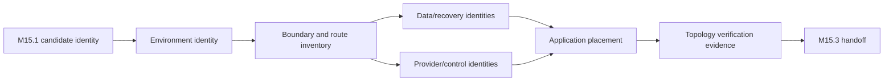

# M15.2 Production Deployment Topology Implementation Planning

**Status:** Accepted; Closed
**Date:** 2026-07-22

## Objective

Define the ordered implementation plan for realizing accepted M14.1 deployment
topology with accepted M15.1 artifact identity. This milestone is planning-only:
it creates no infrastructure, network, deployment, configuration, certificate,
cloud resource, script, CI/CD, or runtime behavior.

## Inputs And Invariants

- M15.1 immutable artifact/provenance identity is the only candidate input.
- M14.1 four environments, five zones, seven trust boundaries and ownership are
  authoritative planning inputs and remain unchanged.
- Pool OS remains one logical modular-monolith application deployment unit.
- Environment, workload, operator, recovery, provider and artifact identities
  are distinct; no route or credential crosses environments implicitly.
- Undeclared placement, route, owner, dependency, or identity fails closed.

## Realization Units

| Unit | Planned responsibility | Accountable owner | Prohibited ownership |
|---|---|---|---|
| Environment identity | Isolate local, integration, RC and production scope | Platform/Security | Domain semantics |
| Edge boundary | Admit only declared application ingress | Platform/Security | Business decisions |
| Application placement | Host immutable modular-monolith candidate | Application/Platform | Provider credentials or durable-domain ownership |
| Data boundary | Expose only domain-owned persistence/replay ports | Data/domain owners | Coach or product policy |
| Outbound integration | Mediate declared external capability egress | Integration/Security | Direct domain-internal access |
| Operations/control | Carry sanitized observation and audited administration | Operations/Security | User traffic or domain mutation |
| Recovery boundary | Isolate protection/restore validation authority | Data/Recovery/Security | Normal serving authority before acceptance |

Concrete products and resources are deferred.

## Environment Realization Sequence

1. Create the environment identity and accountable owner record.
2. Bind the accepted M15.1 candidate identity and configuration schema, never
   secret values, to the environment plan.
3. Establish trust-boundary and route inventory before placing workloads.
4. Plan data, provider, operations/control and recovery identities independently.
5. Place the modular-monolith candidate only after declared dependencies have
   compatible identities and owners.
6. Verify denied cross-environment, direct data, undeclared egress and control-
   plane paths before promotion eligibility.
7. Produce candidate/environment/topology evidence for M15.3; no environment
   becomes production through naming alone.

The sequence is repeated independently for integration, release candidate and
production. Local remains synthetic/local and cannot donate state upward.

## Runtime Placement Governance

The application is one logical deployment unit identified by exact candidate,
environment, placement group, topology version, configuration schema,
dependency-set identity and owner. Instance multiplicity is a later capacity
decision and must not create instance-owned durable state or alter deterministic
contracts. Placement cannot infer domain ownership from process, host, zone, or
storage proximity.

## Network Boundary Realization Plan

| Boundary | Allowed flow declaration | Required verification evidence |
|---|---|---|
| Client to edge | Approved client class to declared entry purpose | Environment, route, identity/auth policy and deny behavior |
| Edge to application | Edge identity to exact application entry | Candidate, route and correlation binding |
| Application to data | Workload identity through domain-owned public port | Resource/action owner, environment and denial of direct internals |
| Application to integration | Registered capability through frozen adapter/provider port | Capability, destination, data class and disablement identity |
| Integration to provider | Allowlisted external destination/purpose | Credential owner, environment, privacy and failure policy |
| Runtime to operations | Sanitized telemetry/control evidence boundary | Schema/classification, redaction, authority and audit |
| Data to recovery | Declared protection identity into isolated boundary | Source/recovery identities, integrity and access separation |

This plan defines flows and proof obligations, not protocols, rules, addresses,
DNS, certificates, firewall, proxy, load balancer or network implementation.

## Isolation Planning

- Separate environment identities, credentials, state, telemetry, provider
  accounts and recovery authority.
- Separate user ingress from audited administrative/control access.
- Separate workload use authority from secret/key/certificate custody.
- Separate primary serving state from recovery candidate validation.
- Separate external provider access from domain internals and raw Evidence.
- Separate artifact custody/promotion authority from application execution.

Any justified exception requires exact scope, owner, risk, compensating control,
expiry and PO/Security approval before a future implementation milestone.

## Deployment Ownership RACI

Roles: PO = Product Owner, PLAT = Platform, APP = Application, SEC = Security,
OPS = Operations, DOM = domain owner, INT = Integration.

| Activity | PO | PLAT | APP | SEC | OPS | DOM | INT |
|---|---|---|---|---|---|---|---|
| Approve topology scope/trade-off | A/R | C | C | C | C | C | C |
| Own environment/boundary realization | I | A/R | C | C | C | C | C |
| Own application placement contract | I | C | A/R | C | C | C | I |
| Own identity/isolation policy | I | R | C | A | C | C | C |
| Own domain data boundary | I | C | C | C | I | A/R | I |
| Own external-provider boundary | I | C | C | C | C | I | A/R |
| Own operations/control boundary | I | C | C | C | A/R | C | I |
| Accept topology evidence | A | R | C | C | C | C | C |

Every concrete resource/route has one accountable owner.

## Implementation Dependency Graph

The graph has eight nodes, eight directed edges and zero cycles.

## Topology Compatibility Verification

Future verification binds candidate, topology version, environment, placement,
configuration schema, migrations, Knowledge/contracts, dependency/provider
identities and evidence index. It validates exact one-to-one ownership,
complete route/dependency coverage, public-port use, environment isolation,
denied undeclared paths and canonical topology inventory. Mixed, stale,
duplicate, orphan or incomplete declarations fail closed.

## Rollback Topology Planning

Rollback identifies prior candidate and topology identities, target environment,
compatible configuration/migration/Knowledge/provider set, data constraints,
route/placement reversal order, credential/authority handling, abort triggers,
validation, owner and evidence. Topology rollback cannot rewrite domain history
or silently retain new routes, credentials or serving authority.

## Acceptance Evidence

| Evidence class | Minimum planning contents | Owner |
|---|---|---|
| Environment inventory | Stable identity, purpose, owner, isolation relationships | Platform |
| Topology manifest | Candidate, zones, placements, dependencies and positions | Architecture/Platform |
| Boundary/route register | Source, destination, purpose, identity, data class, owner | Platform/Security |
| Resource ownership | Exact resource class and one accountable owner | Owning team |
| Compatibility record | Candidate/config/migration/Knowledge/contracts/providers | Application/domain owners |
| Isolation verification | Declared denied paths and evidence outcome | Security/Platform |
| Rollback plan evidence | Previous identities, order, authority and validation | Platform/Recovery |
| Handoff record | Accepted topology/evidence identity for M15.3 | Platform/Operations |

No evidence mechanism is implemented here.

## Fail-Closed Implementation Gates

Future implementation is blocked without accepted M15.1 identity, exact
environment/topology version, complete ownership, declared routes/dependencies,
public-port boundaries, isolation/denial evidence, compatibility, rollback and
M15.3 handoff identity. Successful resource creation alone is not readiness.

## Acceptance Criteria

- Realization units, placement, environment sequence, boundary flows,
  isolation, ownership, dependency graph, compatibility, rollback, evidence and
  fail-closed gates are explicit.
- No infrastructure/Terraform/Kubernetes/Docker, cloud product, networking/
  firewall/DNS/certificate, deployment script, CI/CD, runtime behavior,
  production source, ADR, contract, or extra planning document is introduced.
- Frozen M3-M13 and accepted M14/M15.0-M15.1 remain unchanged.
- Worktree changes are limited to this artifact and `MEMORY.md`.

## Engineering Evidence

- Planning inventory: 7 realization units, 7 boundary obligations, dependency
  graph 8 nodes / 8 edges / 0 cycles, and 8 evidence classes.
- Full app regression: 881/881 tests passed.
- Knowledge package regression: 75/75 tests passed.
- Protected M3-M13 freeze regression: 44/44 tests passed.
- Architecture Fitness: 133 existing violations, 0 new violations.
- `git diff --check`: clean.
- Worktree: exactly this planning artifact and `MEMORY.md`.
- Frozen, accepted M14/M15.0-M15.1, generated and production artifacts:
  unchanged.

## Product Owner Decision

Accepted and closed on 2026-07-22. M15.3 Production Operations Implementation
Planning is authorized next as planning-only work.
