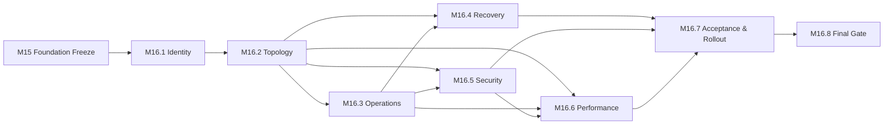

# M16.0 Production Readiness Implementation Execution Planning

**Status:** Accepted; Closed
**Date:** 2026-07-22

## Objective

Define the dependency-ordered execution roadmap that may later realize the
accepted and frozen M15.1-M15.8 production-readiness plans. M16.0 is planning
only. It implements no production runtime, deployment, infrastructure, CI/CD,
monitoring, recovery, security, performance, Flutter behavior or contract.

## Authority And Inputs

- M15 Foundation Freeze is the immutable compatibility root.
- Accepted M14 governance and frozen M3-M13 remain transitively protected.
- ADR-015 is Proposed and cannot authorize implementation by itself.
- Product Owner must separately authorize every M16 execution capability,
  including exact files and permitted mechanism classes.
- Infrastructure may realize policy only through public ports and accepted
  contracts; it cannot own domain, Evidence, Knowledge, Coach or AI semantics.

M16.0 changes no cross-domain contract.

## Execution Capability Inventory

| Capability | Future execution responsibility | Depends on |
|---|---|---|
| M16.1 Release Identity Execution | Produce candidate identity/provenance evidence | M15 Freeze |
| M16.2 Environment & Topology Execution | Realize accepted placement and boundary mechanisms | M16.1 |
| M16.3 Operations Execution | Realize sanitized operational evidence and ownership mechanisms | M16.2 |
| M16.4 Recovery & DR Execution | Realize protected restore/recovery mechanisms and evidence | M16.2, M16.3 |
| M16.5 Security Controls Execution | Realize accepted security controls at declared boundaries | M16.2, M16.3 |
| M16.6 Performance & Capacity Execution | Realize authorized measurement/capacity evidence | M16.2, M16.3, M16.5 |
| M16.7 Acceptance & Rollout Execution | Realize candidate gates and bounded rollout mechanisms | M16.4-M16.6 |
| M16.8 Final Readiness Gate Execution | Produce independent audit and explicit PO decision | M16.7 |

The internal M16 graph has eight nodes, thirteen edges and zero cycles. M15
Freeze is its external root.

## Execution Sequencing

1. Produce a reproducible candidate identity before provisioning or binding any
   candidate-specific mechanism.
2. Realize environment/topology boundaries before operations, recovery,
   security or capacity mechanisms rely on them.
3. Establish sanitized operational evidence custody before exercises and
   measurements can become acceptance evidence.
4. Execute recovery and security as separately owned capabilities with
   independent rollback and failure evidence.
5. Execute performance/capacity work only after correctness, topology,
   operations and security identities are stable and accepted.
6. Execute bounded acceptance/rollout only with compatible M16.4-M16.6 evidence.
7. Execute the independent final gate last; it records authority and never
   implies release execution by a tool.

No dependent capability starts before its predecessors are Accepted/Closed and
repository-pushed. Parallel work requires graph independence and separate scope.

## Ownership And Boundaries

| Concern | Accountable owner | Required boundary |
|---|---|---|
| Candidate identity | Release/Platform | M15.1 frozen identity semantics |
| Topology/environment | Platform/Architecture | M15.2 boundaries and public runtime ports |
| Operational evidence | Operations | M15.3 sanitized append-only evidence semantics |
| Recovery/data | Recovery plus domain owners | Domain-owned persistence/replay ports |
| Security controls | Security plus Platform/Application | Declared identity/resource/application boundaries |
| Performance/capacity | Product/Application/Platform | Accepted workload and correctness semantics |
| Rollout/acceptance | Release Manager/Operations/PO | Candidate-bound M15.7 evidence and authority |
| Final gate | PO/independent auditor | M15.8 criteria, sign-offs and binary decision |

## Verification Strategy

Each future capability plans and then supplies focused unit/contract evidence,
authorized integration/operational evidence, negative and failure semantics,
rollback/disablement proof, full app and Knowledge regression, protected
M3-M15 freeze suites, Architecture Fitness, generated/protected artifact check,
security/privacy review and clean diff. Evidence binds exact source, artifact,
configuration, provider, environment, contract and owner identities.

M16.0 creates no implementation test or production signal.

## Rollback Strategy

Every future capability must identify last-known-good state, compatibility and
migration window, disablement/rollback authority, abort triggers, data/history
implications, validation and retained failure evidence before implementation.
Rollback cannot rewrite Evidence or Knowledge publication history, delete audit
records, bypass domain ownership or reuse approval for another candidate.

## Acceptance Gates

A future capability fails closed without accepted predecessor identities, exact
authorized files/mechanisms, owning domain and public contracts, threat/data
review, deterministic or attributable evidence as appropriate, denial/failure
evidence, rollback, compatibility, verification, protected-artifact integrity
and explicit Product Owner acceptance before commit/push.

## Definition Of Done

- Eight future execution capabilities, owners, dependencies, sequence,
  verification, rollback, evidence and acceptance gates are explicit.
- ADR-015 remains Proposed and cites normative authority and architecture
  evidence.
- Exactly four authorized M16.0 files change.
- No production/runtime source, deployment, infrastructure, CI/CD, monitoring,
  recovery, security, performance, Flutter behavior, test implementation,
  runtime contract or frozen artifact is introduced or changed.

## Engineering Evidence

- Capability graph: eight future M16 capabilities, thirteen internal edges and
  zero cycles, rooted in the accepted M15 Foundation Freeze.
- Full app regression: 885/885.
- Knowledge package regression: 75/75.
- Protected M3-M15 freeze regression: 48/48.
- Architecture Fitness: 133 existing violations / 0 new.
- `git diff --check`: clean.
- Worktree contains exactly the four authorized M16.0 artifacts; frozen,
  accepted, generated, production/runtime and publication artifacts remain
  unchanged.
