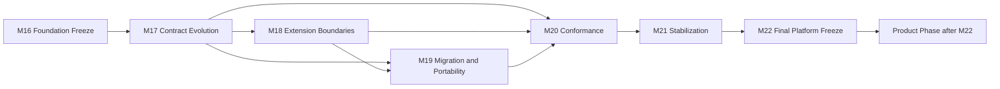

# M17.0 Platform Evolution Planning

**Status:** Accepted; Closed  
**Date:** 2026-07-22

## Objective

Define the dependency-ordered platform roadmap from the frozen M16 foundation
through the final M22 platform architecture milestone. M17.0 is planning only.
It introduces no product feature, production source, runtime behavior,
infrastructure mechanism, UI, persistence, networking, AI execution or
deployment change.

## Authority And Boundaries

- Constitution v1.4.0 remains the highest normative authority.
- The Product Owner directive `Platform M1-M22 -> Product after M22` is the
  authoritative delivery order.
- The M16 Foundation Freeze is the immutable compatibility root for M17-M22.
- Accepted ADRs and frozen M3-M16 contracts remain protected.
- ADR-016 is Proposed and grants no implementation authority.
- Every future milestone requires a separate executable scope, exact-file
  authorization, engineering evidence and Product Owner acceptance.

The Architecture Control Plane owns this plan. No business domain model,
behavior or cross-domain runtime contract changes in M17.0.

## Remaining Platform Capability Inventory

| Milestone | Planned platform capability | Primary owner | Depends on |
|---|---|---|---|
| M17 | Contract evolution governance | Architecture and contract owners | M16 Freeze |
| M18 | Extension and plugin boundary governance | Architecture and Platform | M17 |
| M19 | Migration and portability governance | Architecture, Data and domain owners | M17, M18 |
| M20 | Platform conformance and certification | Architecture and Quality | M17-M19 |
| M21 | Foundation stabilization and amendment closure | Architecture, Security and Operations | M20 |
| M22 | Final platform architecture validation and freeze | Product Owner and independent auditor | M21 |

The internal M17-M22 graph has six nodes, eight edges and zero cycles. M16
Foundation Freeze is its external root; the Product phase is a downstream
boundary and is not authorized by this plan.

## Milestone Definition Of Done

### M17 - Contract Evolution Governance

- Define additive evolution, deprecation, compatibility-window and amendment
  rules for frozen public contracts.
- Define owners, semantic identity preservation, provenance and digest rules.
- Prove proposed evolution paths cannot bypass constitutional amendment.
- Do not change a frozen contract or implement an adapter.

### M18 - Extension And Plugin Boundary Governance

- Define provider-neutral extension registration, capability isolation and
  lifecycle boundaries over accepted public ports.
- Establish ownership, failure isolation, compatibility and revocation gates.
- Prevent plugins from importing persistence or domain internals.
- Do not implement providers, plugins, networking or dynamic loading.

### M19 - Migration And Portability Governance

- Define schema/contract migration, upcast, export/import and provider
  portability evidence requirements.
- Preserve immutable Evidence, Knowledge publication history, semantic IDs and
  deterministic replay across migration.
- Define rollback/forward-repair ownership and mixed-version rejection.
- Do not execute migrations or select infrastructure providers.

### M20 - Platform Conformance And Certification

- Define a machine-verifiable conformance profile for public contracts,
  boundaries, compatibility, replay, provenance and provider neutrality.
- Define certification evidence, negative cases and independent review.
- Bind certification to an exact source/freeze identity.
- Do not certify through prose alone or implement product behavior.

### M21 - Foundation Stabilization And Amendment Closure

- Resolve or explicitly reject remaining platform gaps, exceptions and
  temporary compatibility windows.
- Require constitutional process for any large-scale architecture change.
- Produce final security, privacy, operational and architecture evidence index.
- Permit no new platform capability after its stabilization cutoff without a
  separately approved amendment.

### M22 - Final Platform Architecture Validation And Freeze

- Independently validate M17-M21 and the transitive M3-M16 freeze chain.
- Produce deterministic manifests and proof records for the final platform
  contract and implementation set.
- Record a binary Product Owner freeze decision and the post-freeze change
  policy.
- Close the Platform phase; Product planning remains separately authorized only
  after M22 is Accepted, repository-closed and pushed.

## Sequencing And Ownership Rules

1. A milestone starts only after all predecessors are Accepted, Closed and
   repository-pushed.
2. Contract/domain owners retain semantic authority; Architecture governs
   boundaries and compatibility, not business truth.
3. Infrastructure and extensions use public ports and cannot absorb Knowledge,
   Evidence, Intelligence, Simulation or Experience policy.
4. M22 is the last scheduled point for large-scale platform architecture
   change. Any later breaking change requires the constitutional amendment
   process.
5. Product work cannot be used as evidence to bypass an incomplete platform
   gate.

## Compatibility Strategy

All future work starts from the exact M16 freeze identity and preserves
semantic IDs, version and provenance bindings, canonical ordering,
deterministic digests, replay behavior and public dependency direction.
Additive compatible extensions are preferred. Deprecation requires an owned
window and evidence; breaking changes require explicit constitutional and
contract migration authority. Mixed, stale, ambiguous or unowned identities
fail closed.

## Verification And Evidence Strategy

Each future milestone must provide focused contract/governance tests where
applicable, full app and Knowledge regression, all protected freeze tests,
Architecture Fitness with zero new violations, generated/protected artifact
integrity, deterministic replay/digest evidence, negative compatibility cases,
an exact diff audit and `git diff --check`. Evidence must bind source, contract,
freeze, owner, authority, inputs and results; documentation alone is not proof
of implementation maturity.

## Rollback Strategy

Planning artifacts can be superseded only by an explicit Product Owner
directive. Future implementation scopes must declare last-known-good freeze
identity, compatibility window, disablement or rollback authority, data/history
effects, validation and retained failure evidence before editing. Rollback must
not rewrite Evidence, Knowledge publication history, audit history or frozen
proofs.

## Acceptance Gates

M17.0 fails closed if the roadmap is cyclic, starts Product work before M22,
changes production/frozen artifacts, weakens Constitution v1.4.0, grants
implementation authority through ADR-016, omits ownership or rollback, or
increases Architecture Fitness violations.

## Engineering Evidence

- Planned graph: six milestones, eight internal edges, zero cycles, rooted in
  the accepted M16 Foundation Freeze.
- Full app regression: 945/945.
- Knowledge package regression: 75/75.
- Protected M3-M16 freeze regression: 52/52.
- Architecture Fitness: 133 existing violations / 0 new.
- `git diff --check`: clean.
- Exactly four authorized planning artifacts are changed.
- No production source, test implementation, frozen artifact, generated file,
  runtime contract, Knowledge/publication artifact or product feature changes.
- Generated architecture health was restored to its protected baseline after
  verification.

Product Owner accepted and closed M17.0 on 2026-07-22 and authorized commit and
push with no additional repository modifications.
