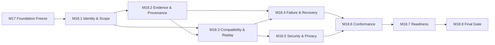

# M18.0 Platform Integration Planning

**Status:** Accepted; Closed
**Date:** 2026-07-22

## Objective

Define the governed integration roadmap for frozen platform capabilities from
M18 through the final M22 platform milestone. M18.0 is planning only. It
introduces no runtime, contract, implementation, UI, infrastructure,
persistence, networking, AI execution or Product behavior.

## Authority And Inputs

- Constitution v1.4.0 remains normative authority.
- Accepted ADRs and M3-M17 freezes are protected.
- M17 Foundation Freeze digest
  `ffa61943bda52b5a3b18aa59293cdc2242593f4b5a886d4ddfd3ea13efb64989`
  is the direct planning root.
- ADR-017 is Proposed and grants no implementation authority.
- Every M18.x capability requires separate exact-file authorization,
  verification, Product Owner acceptance, commit and push.

Architecture Control Plane owns integration governance. Domain owners retain
semantic truth and public-contract ownership.

## Platform Integration Objectives

1. Prove accepted components compose only through public ports/contracts.
2. Preserve semantic IDs, versions, provenance, deterministic replay/digests
   and M3-M17 compatibility across integrated flows.
3. Make boundary, authority, evidence and rollback identities end-to-end
   traceable without copying domain internals.
4. Fail closed on mixed, stale, duplicate, contradictory or missing inputs.
5. Keep provider/infrastructure mechanisms replaceable and policy-free.
6. Produce independently verifiable readiness evidence before M19.

## M18 Capability Decomposition

| Capability | Planning responsibility | Depends on |
|---|---|---|
| M18.1 Integration Identity & Scope | Candidate identity, participating contracts and exact boundaries | M17 Freeze |
| M18.2 Evidence & Provenance Integration | End-to-end evidence custody, lineage and sanitization | M18.1 |
| M18.3 Compatibility & Replay Integration | Version matrix, canonical replay and mixed/stale rejection | M18.1, M18.2 |
| M18.4 Failure, Recovery & Supersession Integration | Cross-boundary failures, rollback/forward repair and retained attempts | M18.2, M18.3 |
| M18.5 Security & Privacy Boundary Integration | Access/data classification, minimization and audit ownership | M18.3 |
| M18.6 Integration Conformance | Executable conformance profile and negative cases | M18.4, M18.5 |
| M18.7 Integration Readiness | Evidence index, unresolved gaps/exceptions and transition gate | M18.6 |
| M18.8 Final Integration Gate | Independent audit and binary PO decision | M18.7 |

The internal M18 graph has eight nodes, ten edges and zero cycles. The M17
Freeze is its external root.

## Cross-Domain Integration Boundaries

| Flow | Allowed integration | Prohibited coupling |
|---|---|---|
| Experience -> Evidence | Commands through Evidence application contract | Event-store/persistence access or inference |
| Experience -> Intelligence | Commands/queries and projections through application port | Coach internals, raw Evidence or policy reconstruction |
| Knowledge -> Intelligence | Published versioned Knowledge snapshot | Authoring/compiler internals or generated-file mutation |
| Evidence -> Intelligence | Immutable events/projections/snapshots | Intelligence rewriting facts or using recommendations as ability evidence |
| Intelligence -> Simulation | Versioned request/result port | Simulation learning player identity, tactics or Coach policy |
| Intelligence -> Experience | Decisions, traces and projections | UI inferring mastery/recommendations |
| Infrastructure/extensions -> domains | Accepted public adapters/capabilities | Semantic ownership, private imports or fallback policy |
| AI boundary | AISession input and accepted structured output contracts | Direct access to deterministic/domain internals or self-review |

No planned integration creates a new compile-time dependency. A future edge
requires owner review, contract identity and Architecture Fitness evidence.

## Compatibility Preservation

Every integration package binds exact M17 freeze, producer/consumer contract
versions, canonicalization/digest rules, capability set, evidence/provenance,
owner/authority and rollback identity. Additive compatibility follows M17.2;
adapters/upcasters are explicit and cannot invent semantics. Breaking changes
require amendment and migration authority. Mixed or unsupported combinations
fail closed without fallback.

## Governance And Ownership

| Concern | Accountable owner |
|---|---|
| Integration identity and dependency graph | Architecture/Platform |
| Domain semantics and contract compatibility | Producing/consuming domain owners |
| Evidence integrity and negative cases | Quality/Architecture and source owners |
| Security/privacy/data access | Security/Privacy and data owners |
| Failure recovery and rollback | Integration owner plus affected domain owners |
| Readiness and final acceptance | Independent reviewer and Product Owner |

Infrastructure executes only separately authorized mechanisms and cannot own
integration policy. Product Owner approval cannot be inferred from tooling.

## Evidence Requirements

Each future M18.x decision package includes exact source/freeze/candidate,
contracts and owners, allowed dependency graph, compatibility matrix,
canonical replay/digest, positive and negative flows, evidence custody,
security/privacy review, failure attempts, rollback/forward repair, exceptions,
verification tool/rule versions and PO decision. Evidence remains append-only
or superseding and excludes secrets/raw data not required by the boundary.

## Rollback And Supersession

Before integration, record the last-known-good component/freeze identities and
compatibility window. Failure disables/rejects the candidate and retains the
attempt. Rollback cannot rewrite Evidence, Knowledge publication, audit or
freeze history; incompatible state requires owner-approved forward repair.
Supersession links immutable predecessor/successor packages and restarts review
when scope or identity changes.

## Acceptance Gates

Every capability fails closed without accepted predecessors, exact scope,
owners/public contracts, compatibility and boundary proof, positive/negative
evidence, rollback, security/privacy review, full regressions, protected freeze
integrity, Architecture Fitness 0 new, clean diff and explicit PO acceptance
before repository closure.

## M18-M22 Transition

- M18 proves governed integration of the frozen platform.
- M19 may plan migration/portability only after M18 final gate and freeze.
- M20 may certify conformance only after M19 closes.
- M21 stabilizes gaps/exceptions after M20 certification.
- M22 independently validates and freezes the final Platform architecture.
- Product work remains prohibited until M22 is Accepted, Closed and pushed.

## Definition Of Done

- Eight M18 capabilities, ten acyclic dependencies and owners are explicit.
- Eight cross-domain boundary rows preserve public dependencies and ownership.
- Compatibility, evidence, rollback, security and acceptance gates are defined.
- M18-M22 sequencing and M19 entry criteria are explicit.
- ADR-017 remains Proposed.
- Exactly four authorized M18.0 planning artifacts change.
- No runtime/production source, contract, frozen/generated artifact,
  implementation or Product behavior changes.

## Engineering Evidence

- Planned graph: eight M18 nodes, ten internal edges, zero cycles, rooted in
  the accepted M17 Foundation Freeze.
- Full app regression: 949/949.
- Knowledge package regression: 75/75.
- Protected M3-M17 freeze regression: 56/56.
- Architecture Fitness: 133 existing violations / 0 new.
- `git diff --check`: clean.
- Generated health restored; exact four-file scope confirmed.

Product Owner accepted and closed M18.0 on 2026-07-22 and authorized repository
closure.
